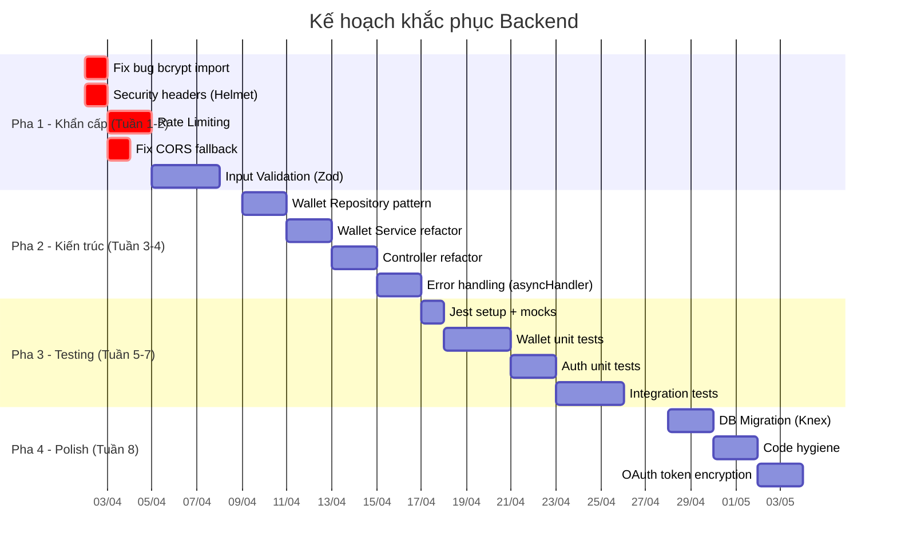

# 🛠️ KẾ HOẠCH KHẮC PHỤC BACKEND - Chi tiết & Ưu tiên

**Dự án:** English Chatbot Backend  
**Ngày lập:** 2026-04-01  
**Cơ sở:** Phân tích mã nguồn thực tế + [MAINTAINABILITY_REPORT.md](file:///d:/english-chatbot/MAINTAINABILITY_REPORT.md)

---

## Mục lục

| # | Vấn đề | Mức độ rủi ro | Pha |
|---|--------|:---:|:---:|
| 1 | [Fat Controller & Tight Coupling](#1-fat-controller--tight-coupling) | 🔴 Cao | 1 |
| 2 | [Thiếu Input Validation](#2-thiếu-input-validation-library) | 🔴 Cao | 1 |
| 3 | [Bảo mật thiếu hụt](#3-bảo-mật-thiếu-hụt) | 🔴 Cao | 1 |
| 4 | [Error Handling không nhất quán](#4-error-handling-không-nhất-quán) | 🟡 Trung bình | 2 |
| 5 | [Không có Automated Test](#5-automated-testing) | 🟡 Trung bình | 2 |
| 6 | [Database Migration thủ công](#6-database-migration) | 🟡 Trung bình | 3 |
| 7 | [Dead Code & Hardcoding](#7-dead-code--hardcoding--code-hygiene) | 🟢 Thấp | 3 |

---

## 1. Fat Controller & Tight Coupling

### 1.1. Hiện trạng

> [!CAUTION]
> Đây là rủi ro lớn nhất của hệ thống. Nếu không xử lý, mọi tính năng mới sẽ tiếp tục tăng nợ kỹ thuật.

**Vấn đề cốt lõi:** Nhiều Controller đang trực tiếp `import pool from '#db'` và viết Raw SQL, đặc biệt nghiêm trọng ở module **Wallet** (liên quan trực tiếp đến tiền tệ).

**File bị ảnh hưởng (truy vấn DB trực tiếp trong Controller):**

| File | Dòng code | Mức độ |
|------|-----------|--------|
| [deposit.controller.js](file:///d:/english-chatbot/backend/src/modules/wallet/controllers/deposit.controller.js) | ~331 LOC | 🔴 Nghiêm trọng |
| [withdrawal.controller.js](file:///d:/english-chatbot/backend/src/modules/wallet/controllers/withdrawal.controller.js) | ~254 LOC | 🔴 Nghiêm trọng |
| [vnpay.controller.js](file:///d:/english-chatbot/backend/src/modules/wallet/controllers/gateways/vnpay.controller.js) | ~264 LOC | 🔴 Nghiêm trọng |
| [momo.controller.js](file:///d:/english-chatbot/backend/src/modules/wallet/controllers/gateways/momo.controller.js) | N/A | 🔴 Nghiêm trọng |
| [payment.controller.js](file:///d:/english-chatbot/backend/src/modules/wallet/controllers/gateways/payment.controller.js) | N/A | 🟡 Trung bình |

**Hệ quả cụ thể (đã tìm thấy trong code):**

1. **Code trùng lặp:** Logic "credit balance vào wallet" (SELECT FOR UPDATE → tính toán → UPDATE balance → INSERT transaction) lặp lại gần **giống hệt** ở cả 3 file: `deposit.controller.js`, `vnpay.controller.js`, `momo.controller.js`.
2. **`getOrCreateWallet()` bị duplicate:** Có trong cả `deposit.controller.js` (dòng 60-75) VÀ `wallet.service.js` (dòng 11-34) — cùng logic, khác implementation.
3. **Không thể Unit Test:** Logic tính phí rút tiền (fee = $0.5, convert currency, tính net_amount) dính chặt với DB transaction nên không test riêng được.

### 1.2. Giải pháp: Service Layer + Repository Pattern

```
Controller (nhận request, validate sơ bộ, gọi service, trả response)
    ↓
Service (business logic thuần túy, không biết HTTP)
    ↓
Repository (truy vấn DB, trả data thuần)
```

### 1.3. Kế hoạch thực hiện chi tiết

#### Bước 1: Tạo `wallet.repository.js`

```javascript
// backend/src/modules/wallet/repositories/wallet.repository.js
import pool from '#db';

class WalletRepository {
    /**
     * Lấy wallet theo user_id (không lock)
     */
    async findByUserId(userId) {
        const [wallets] = await pool.execute(
            'SELECT id, user_id, balance, currency, status, created_at, updated_at FROM user_wallets WHERE user_id = ?',
            [userId]
        );
        return wallets[0] || null;
    }

    /**
     * Lấy wallet với lock (FOR UPDATE) - dùng trong transaction
     */
    async findByIdForUpdate(connection, walletId) {
        const [wallets] = await connection.execute(
            'SELECT * FROM user_wallets WHERE id = ? FOR UPDATE',
            [walletId]
        );
        return wallets[0] || null;
    }

    /**
     * Tạo wallet mới
     */
    async create(userId, currency = 'USD') {
        const [result] = await pool.execute(
            'INSERT INTO user_wallets (user_id, balance, currency, status) VALUES (?, 0.00, ?, ?) RETURNING id',
            [userId, currency, 'active']
        );
        return result[0];
    }

    /**
     * Cập nhật balance
     */
    async updateBalance(connection, walletId, newBalance) {
        await connection.execute(
            'UPDATE user_wallets SET balance = ?, updated_at = NOW() WHERE id = ?',
            [newBalance, walletId]
        );
    }

    /**
     * Tạo transaction record
     */
    async createTransaction(connection, data) {
        const { walletId, userId, type, amount, balanceBefore, balanceAfter,
                description, status, paymentMethod, paymentGatewayId, metadata } = data;

        const [rows] = await connection.execute(
            `INSERT INTO wallet_transactions 
             (wallet_id, user_id, type, amount, balance_before, balance_after, 
              description, status, payment_method, payment_gateway_id, metadata)
             VALUES (?, ?, ?, ?, ?, ?, ?, ?, ?, ?, ?) RETURNING id`,
            [walletId, userId, type, amount, balanceBefore, balanceAfter,
             description, status, paymentMethod || null, paymentGatewayId || null,
             JSON.stringify(metadata || {})]
        );
        return rows[0];
    }

    /**
     * Tìm transaction theo ID
     */
    async findTransactionById(transactionId) {
        const [transactions] = await pool.execute(
            'SELECT * FROM wallet_transactions WHERE id = ?',
            [transactionId]
        );
        return transactions[0] || null;
    }

    /**
     * Cập nhật status của transaction
     */
    async updateTransactionStatus(connection, transactionId, updates) {
        const { status, balanceAfter, paymentGatewayId, metadata } = updates;
        
        let query = 'UPDATE wallet_transactions SET status = ?';
        const params = [status];

        if (balanceAfter !== undefined) {
            query += ', balance_after = ?';
            params.push(balanceAfter);
        }
        if (paymentGatewayId) {
            query += ', payment_gateway_id = ?';
            params.push(paymentGatewayId);
        }
        if (metadata) {
            query += `, metadata = metadata || ?::jsonb`;
            params.push(JSON.stringify(metadata));
        }

        query += ' WHERE id = ?';
        params.push(transactionId);

        await connection.execute(query, params);
    }
}

export default new WalletRepository();
```

#### Bước 2: Mở rộng `wallet.service.js` — thêm business logic tập trung

```javascript
// Thêm vào wallet.service.js — logic "credit deposit" tập trung 1 chỗ
// Thay vì copy-paste qua vnpay.controller, momo.controller, deposit.controller

/**
 * Credit deposit vào wallet (dùng chung cho mọi gateway)
 * @param {Object} params
 * @param {number} params.transactionId - ID giao dịch pending
 * @param {string} params.gatewayId - ID giao dịch bên gateway
 * @param {Object} params.gatewayMetadata - Dữ liệu bổ sung từ gateway
 * @returns {Object} { success, newBalance, creditedAmount, currency }
 */
async creditDeposit({ transactionId, gatewayId, gatewayMetadata = {} }) {
    const transaction = await walletRepository.findTransactionById(transactionId);
    if (!transaction) throw new AppError('Transaction not found', 404);
    if (transaction.status !== 'pending') {
        return { success: false, alreadyProcessed: true, status: transaction.status };
    }

    const connection = await pool.getConnection();
    await connection.beginTransaction();

    try {
        const wallet = await walletRepository.findByIdForUpdate(connection, transaction.wallet_id);
        if (!wallet) throw new AppError('Wallet not found', 404);

        let creditedAmount = parseFloat(transaction.amount);
        if (wallet.currency !== 'USD') {
            creditedAmount = currencyService.convertCurrency(creditedAmount, 'USD', wallet.currency);
        }
        const newBalance = parseFloat(wallet.balance) + creditedAmount;

        await walletRepository.updateBalance(connection, wallet.id, newBalance);
        await walletRepository.updateTransactionStatus(connection, transactionId, {
            status: 'completed',
            balanceAfter: newBalance,
            paymentGatewayId: gatewayId,
            metadata: {
                completed_at: new Date().toISOString(),
                credited_amount: creditedAmount,
                credited_currency: wallet.currency,
                ...gatewayMetadata
            }
        });

        await connection.commit();
        return { success: true, newBalance, creditedAmount, currency: wallet.currency };
    } catch (error) {
        await connection.rollback();
        throw error;
    } finally {
        connection.release();
    }
}
```

#### Bước 3: Refactor VNPay Controller (ví dụ Before/After)

**BEFORE** (vnpay.controller.js — 100 dòng logic DB trực tiếp):
```javascript
// 50 dòng: SELECT wallet FOR UPDATE, tính toán, UPDATE balance, 
// UPDATE transaction, commit/rollback... copy-paste từ deposit.controller
const [wallets] = await connection.execute(
    'SELECT * FROM user_wallets WHERE id = ? FOR UPDATE', [transaction.wallet_id]
);
// ... 40+ dòng nữa
```

**AFTER** (vnpay.controller.js — gọn gàng):
```javascript
const result = await walletService.creditDeposit({
    transactionId,
    gatewayId: vnpayResult.transactionNo,
    gatewayMetadata: {
        vnpay_transaction_no: vnpayResult.transactionNo,
        vnpay_bank_code: vnpayResult.bankCode,
        vnpay_pay_date: vnpayResult.payDate,
    }
});

if (!result.success) {
    return res.redirect(`${frontendUrl}/wallet?payment=${result.status}`);
}

res.redirect(`${frontendUrl}/wallet?payment=success&amount=${result.creditedAmount}&currency=${result.currency}`);
```

### 1.4. Checklist refactor

- [ ] Tạo `wallet.repository.js` với tất cả DB queries
- [ ] Di chuyển logic `creditDeposit` vào `wallet.service.js`
- [ ] Refactor `vnpay.controller.js` — gọi service thay vì truy vấn DB
- [ ] Refactor `momo.controller.js` — gọi service thay vì truy vấn DB  
- [ ] Refactor `deposit.controller.js` — gọi service thay vì truy vấn DB
- [ ] Refactor `withdrawal.controller.js` — tách logic tính phí, trừ balance vào service
- [ ] Xóa `getOrCreateWallet` duplicate trong `deposit.controller.js`
- [ ] Verify tất cả payment flows vẫn hoạt động

> [!IMPORTANT]
> **Ưu tiên refactor module Wallet trước** vì đây là module xử lý tiền tệ — bug ở đây gây thiệt hại tài chính trực tiếp.

**Ước lượng effort:** 3-4 ngày

---

## 2. Thiếu Input Validation Library

### 2.1. Hiện trạng

> [!WARNING]
> Hệ thống **KHÔNG** sử dụng bất kỳ validation library nào (Joi, Yup, Zod, express-validator). Tất cả validation đều là if/else thủ công, dễ bỏ sót.

**Bằng chứng từ code:**

```javascript
// deposit.controller.js dòng 183
if (!amount || amount <= 0) return res.status(400).json({ message: 'Invalid amount' });

// withdrawal.controller.js dòng 138
if (!amount || amount <= 0) return res.status(400).json({ message: 'Invalid amount' });

// Vấn đề: Không validate type (nếu amount = "abc" thì sao?)
// Không validate precision (nếu amount = 0.001 thì sao?)
// Không validate max (nếu amount = 999999999999 thì sao?)
```

```javascript
// auth.controller.js dòng 143 — register
const { name, email, password } = req.body;
// Không validate: email format, password strength, name length, XSS trong name
```

### 2.2. Giải pháp: Zod + Validation Middleware

#### Bước 1: Cài đặt Zod

```bash
npm install zod
```

#### Bước 2: Tạo Validation Middleware

```javascript
// backend/src/shared/middlewares/validate.middleware.js
import { ZodError } from 'zod';

/**
 * Factory function tạo validation middleware
 * @param {Object} schemas - { body?, query?, params? }
 */
export function validate(schemas) {
    return (req, res, next) => {
        try {
            if (schemas.body) req.body = schemas.body.parse(req.body);
            if (schemas.query) req.query = schemas.query.parse(req.query);
            if (schemas.params) req.params = schemas.params.parse(req.params);
            next();
        } catch (error) {
            if (error instanceof ZodError) {
                return res.status(400).json({
                    message: 'Validation failed',
                    errors: error.errors.map(e => ({
                        field: e.path.join('.'),
                        message: e.message
                    }))
                });
            }
            next(error);
        }
    };
}
```

#### Bước 3: Định nghĩa Schemas theo module

```javascript
// backend/src/modules/wallet/wallet.schemas.js
import { z } from 'zod';

export const createDepositSchema = {
    body: z.object({
        amount: z.number().positive('Amount must be positive').max(1_000_000, 'Amount too large'),
        currency: z.enum(['USD', 'VND']).optional().default('USD'),
        payment_method: z.enum(['vnpay', 'momo', 'bank_transfer'])
    })
};

export const withdrawSchema = {
    body: z.object({
        bank_account_id: z.number().int().positive(),
        amount: z.number().positive('Amount must be positive')
    })
};

export const addBankAccountSchema = {
    body: z.object({
        bank_code: z.string().min(2).max(20),
        bank_name: z.string().min(2).max(100),
        account_number: z.string().min(5).max(30).regex(/^[0-9]+$/, 'Account number must be numeric'),
        account_holder_name: z.string().min(2).max(100),
        branch_name: z.string().max(100).optional()
    })
};

// backend/src/modules/auth/auth.schemas.js
export const registerSchema = {
    body: z.object({
        name: z.string().min(2, 'Name too short').max(50, 'Name too long').trim(),
        email: z.string().email('Invalid email format').toLowerCase().trim(),
        password: z.string()
            .min(8, 'Password must be at least 8 characters')
            .regex(/[A-Z]/, 'Password must contain an uppercase letter')
            .regex(/[0-9]/, 'Password must contain a number')
    })
};

export const loginSchema = {
    body: z.object({
        email: z.string().email().toLowerCase().trim(),
        password: z.string().min(1, 'Password is required')
    })
};
```

#### Bước 4: Áp dụng vào Routes

```javascript
// wallet.routes.js
import { validate } from '#shared/middlewares/validate.middleware.js';
import { createDepositSchema, withdrawSchema } from '../wallet.schemas.js';

router.post('/deposit', verifyToken, validate(createDepositSchema), createDeposit);
router.post('/withdraw', verifyToken, validate(withdrawSchema), withdraw);
```

### 2.3. Checklist validation

- [ ] Cài đặt `zod`
- [ ] Tạo `validate.middleware.js`
- [ ] Tạo schemas cho module Auth (register, login, change password)
- [ ] Tạo schemas cho module Wallet (deposit, withdraw, add bank account)
- [ ] Tạo schemas cho module Chat (send message)
- [ ] Tạo schemas cho module Writing, Listening, Reading, Speaking
- [ ] Áp dụng validate middleware vào tất cả routes

**Ước lượng effort:** 2-3 ngày

---

## 3. Bảo mật thiếu hụt

### 3.1. Rate Limiting — ĐÃ CÀI NHƯNG CHƯA SỬ DỤNG

> [!CAUTION]
> `express-rate-limit` đã có trong `package-lock.json` (phụ thuộc gián tiếp) nhưng **KHÔNG** được import hay sử dụng ở bất kỳ đâu trong code. Các endpoint nhạy cảm (login, register, payment) hoàn toàn **KHÔNG** có rate limiting.

**Rủi ro:**
- Brute-force attack trên endpoint `/auth/login` — thử mật khẩu vô hạn
- API abuse trên endpoint `/chat` — spam gọi OpenAI API, gây chi phí lớn
- DDoS trên webhook `/payment/vnpay/ipn` — gây quá tải DB

**Giải pháp:**

```javascript
// backend/src/shared/middlewares/rateLimiter.middleware.js
import rateLimit from 'express-rate-limit';

// Cho login/register — giới hạn chặt
export const authLimiter = rateLimit({
    windowMs: 15 * 60 * 1000, // 15 phút
    max: 10, // Tối đa 10 lần
    message: { message: 'Too many attempts. Please try again after 15 minutes.' },
    standardHeaders: true,
    legacyHeaders: false,
});

// Cho API thông thường
export const apiLimiter = rateLimit({
    windowMs: 1 * 60 * 1000, // 1 phút
    max: 60, // 60 requests/phút
    message: { message: 'Too many requests. Please slow down.' },
});

// Cho AI endpoints (chat, writing, etc.) — tốn tiền API
export const aiLimiter = rateLimit({
    windowMs: 1 * 60 * 1000,
    max: 10, // 10 AI calls/phút
    message: { message: 'AI request limit reached. Please wait.' },
});

// Cho payment webhooks
export const webhookLimiter = rateLimit({
    windowMs: 1 * 60 * 1000,
    max: 30,
});
```

```javascript
// Áp dụng vào index.js
import { authLimiter, apiLimiter, aiLimiter } from '#shared/middlewares/rateLimiter.middleware.js';

app.use('/auth/login', authLimiter);
app.use('/auth/register', authLimiter);
app.use('/chat', aiLimiter);
app.use('/advanced-chat', aiLimiter);
app.use('/writing', aiLimiter);
app.use('/api', apiLimiter); // default
```

### 3.2. Helmet — Security Headers

**Hiện trạng:** KHÔNG có `helmet` trong dependencies. Trình duyệt không nhận được các headers bảo mật cơ bản.

```bash
npm install helmet
```

```javascript
// index.js
import helmet from 'helmet';
app.use(helmet());
```

### 3.3. CORS — Quá rộng

**Hiện trạng:**
```javascript
// index.js dòng 44-49
app.use(cors({
    origin: process.env.FRONTEND_URL || '*',  // ← NẾU thiếu env var → cho phép MỌI domain
    // ...
}));
```

**Rủi ro:** Nếu `FRONTEND_URL` env var vô tình bị xóa hoặc không set trong production, CORS mở cho tất cả origin.

**Giải pháp:**
```javascript
const allowedOrigins = (process.env.ALLOWED_ORIGINS || process.env.FRONTEND_URL || '')
    .split(',')
    .map(s => s.trim())
    .filter(Boolean);

app.use(cors({
    origin: (origin, callback) => {
        // Cho phép request không có origin (mobile apps, cURL, server-to-server)
        if (!origin || allowedOrigins.includes(origin)) {
            callback(null, true);
        } else {
            callback(new Error('Not allowed by CORS'));
        }
    },
    credentials: true,
    methods: ['GET', 'POST', 'PUT', 'DELETE', 'OPTIONS'],
    allowedHeaders: ['Content-Type', 'Authorization']
}));
```

### 3.4. OAuth Token Encryption — Base64 KHÔNG phải encryption

> [!WARNING]
> OAuth tokens đang được "encrypt" bằng **Base64 encode** — đây KHÔNG phải encryption, bất kỳ ai đọc DB đều giải mã được ngay.

**Hiện trạng** (auth.service.js dòng 128-131):
```javascript
const accessTokenEncrypted = Buffer.from(tokens.access_token || '').toString('base64');
const refreshTokenEncrypted = tokens.refresh_token
    ? Buffer.from(tokens.refresh_token).toString('base64')
    : null;
```

**Giải pháp — Dùng AES-256-GCM:**
```javascript
// backend/utils/encryption.js
import crypto from 'crypto';

const ENCRYPTION_KEY = process.env.TOKEN_ENCRYPTION_KEY; // 32 bytes hex
const ALGORITHM = 'aes-256-gcm';

export function encrypt(text) {
    const iv = crypto.randomBytes(12);
    const key = Buffer.from(ENCRYPTION_KEY, 'hex');
    const cipher = crypto.createCipheriv(ALGORITHM, key, iv);
    let encrypted = cipher.update(text, 'utf8', 'hex');
    encrypted += cipher.final('hex');
    const authTag = cipher.getAuthTag().toString('hex');
    return `${iv.toString('hex')}:${authTag}:${encrypted}`;
}

export function decrypt(encryptedText) {
    const [ivHex, authTagHex, encrypted] = encryptedText.split(':');
    const key = Buffer.from(ENCRYPTION_KEY, 'hex');
    const decipher = crypto.createDecipheriv(ALGORITHM, Buffer.from(ivHex, 'hex'), key);
    decipher.setAuthTag(Buffer.from(authTagHex, 'hex'));
    let decrypted = decipher.update(encrypted, 'hex', 'utf8');
    decrypted += decipher.final('utf8');
    return decrypted;
}
```

### 3.5. JWT — Thiếu Refresh Token

**Hiện trạng:** JWT expiry = 30 ngày, không có refresh token. Nếu token bị lộ, attacker có 30 ngày truy cập.

**Giải pháp ngắn hạn:** Giảm JWT expiry xuống 1 giờ, thêm refresh token flow:
- Access token: 1h expiry (trong header)
- Refresh token: 30d expiry (trong httpOnly cookie)
- Endpoint `/auth/refresh` để đổi access token mới

### 3.6. Login Controller — Thiếu import bcrypt

**Hiện trạng** (auth.controller.js dòng 291):
```javascript
if (!user || !(await bcrypt.compare(password, user.password_hash))) {
//                    ^^^^^^^ bcrypt chưa được import trong file này!
```

> [!CAUTION]
> `bcrypt` được import trong `auth.service.js` nhưng **KHÔNG** được import trong `auth.controller.js`. Hàm `login()` sẽ throw ReferenceError khi được gọi. Đây là **bug thực sự**.

**Fix ngay:**
```javascript
// Đầu file auth.controller.js — thêm import
import bcrypt from 'bcrypt';
```

Hoặc tốt hơn: di chuyển logic compare password vào `auth.service.js`:
```javascript
// auth.service.js
async verifyPassword(email, password) {
    const user = await this.findUserByEmail(email);
    if (!user || !user.password_hash) return null;
    const isMatch = await bcrypt.compare(password, user.password_hash);
    return isMatch ? user : null;
}
```

### 3.7. JWT Token trong URL — Rủi ro lộ token

**Hiện trạng** (auth.controller.js dòng 86-89):
```javascript
res.redirect(`${frontendUrl}/set-password?token=${jwtToken}&role=${user.role}&id=${user.id}`);
res.redirect(`${frontendUrl}?token=${jwtToken}&role=${user.role}&id=${user.id}`);
```

> [!WARNING]
> JWT token xuất hiện trong URL query parameter. URL được log trong server logs, browser history, referrer headers, và proxy logs. Đây là **rủi ro lộ token nghiêm trọng**.

**Giải pháp:** Dùng short-lived code exchange (giống OAuth authorization code flow):
1. Server tạo 1 code ngắn hạn (1 phút), lưu vào DB/Redis
2. Redirect với code: `?code=abc123`
3. Frontend gọi `/auth/exchange-code` để đổi code lấy JWT token
4. Code chỉ dùng được 1 lần

### 3.8. Checklist bảo mật

- [ ] Cài `express-rate-limit` và áp dụng cho mọi endpoint nhạy cảm
- [ ] Cài `helmet` và cấu hình
- [ ] Fix CORS fallback `*`
- [ ] Fix thiếu `import bcrypt` trong auth.controller.js
- [ ] Thay thế Base64 bằng AES-256-GCM cho OAuth tokens
- [ ] Triển khai refresh token flow
- [ ] Loại bỏ JWT token khỏi URL query parameters
- [ ] Thêm `TOKEN_ENCRYPTION_KEY` vào `.env.example`

**Ước lượng effort:** 3-5 ngày

---

## 4. Error Handling không nhất quán

### 4.1. Hiện trạng

**Mẫu lặp lại hàng chục lần trong codebase:**
```javascript
export async function someAction(req, res) {
    try {
        // logic
    } catch (error) {
        console.error('❌ Error doing something:', error);
        res.status(500).json({ message: 'Error doing something' });
    }
}
```

**Vấn đề:**
1. **Boilerplate khổng lồ:** Mỗi controller function đều có try/catch giống hệt nhau
2. **Swallow error details:** Error luôn trả về 500, ngay cả lỗi 400 (validation), 404 (not found)
3. **Không phân biệt operational vs programmer error:** Lỗi "user not found" (expected) cùng xử lý với "DB connection failed" (unexpected)
4. **`AppError` class tồn tại nhưng gần như không ai dùng:** [AppError.js](file:///d:/english-chatbot/backend/utils/AppError.js) chỉ có 10 dòng và không thấy được import ở đâu trong modules

### 4.2. Giải pháp: Async Wrapper + Centralized Error Handler

#### Bước 1: Tạo Async Wrapper

```javascript
// backend/src/shared/middlewares/asyncHandler.js

/**
 * Wrap async controller để tự động bắt lỗi và forward tới error handler
 * Không cần try/catch ở mỗi controller nữa.
 */
export const asyncHandler = (fn) => (req, res, next) => {
    Promise.resolve(fn(req, res, next)).catch(next);
};
```

#### Bước 2: Nâng cấp AppError

```javascript
// backend/utils/AppError.js
export class AppError extends Error {
    constructor(message, statusCode = 500, details = null) {
        super(message);
        this.statusCode = statusCode;
        this.isOperational = true; // Lỗi expected, safe để trả về client
        this.details = details;
    }
}

export class NotFoundError extends AppError {
    constructor(resource = 'Resource') {
        super(`${resource} not found`, 404);
    }
}

export class ValidationError extends AppError {
    constructor(message, details) {
        super(message, 400, details);
    }
}

export class UnauthorizedError extends AppError {
    constructor(message = 'Unauthorized') {
        super(message, 401);
    }
}
```

#### Bước 3: Nâng cấp Error Handler

```javascript
// backend/middlewares/errorHandler.js
import { logger } from '#utils/logger.js';

export default function errorHandler(err, req, res, next) {
    // Log tất cả errors
    logger.error(`[${req.method}] ${req.originalUrl}`, err, {
        userId: req.user?.id,
        body: req.body,
    });

    // Operational errors (AppError) → trả về client
    if (err.isOperational) {
        return res.status(err.statusCode).json({
            message: err.message,
            ...(err.details && { details: err.details }),
        });
    }

    // Programmer errors → trả generic message
    res.status(500).json({
        message: 'Internal server error',
        ...(process.env.NODE_ENV !== 'production' && { stack: err.stack }),
    });
}
```

#### Bước 4: Refactor Controller (Before/After)

**BEFORE:**
```javascript
export async function getWallet(req, res) {
    try {
        const userId = req.user?.id;
        if (!userId) return res.status(401).json({ message: 'Unauthorized' });
        const wallet = await walletService.getWalletOverview(userId);
        res.json({ wallet });
    } catch (error) {
        console.error('❌ Error getting wallet:', error);
        res.status(500).json({ message: 'Error getting wallet information' });
    }
}
```

**AFTER:**
```javascript
export const getWallet = asyncHandler(async (req, res) => {
    const userId = req.user.id; // auth middleware đã đảm bảo user tồn tại
    const wallet = await walletService.getWalletOverview(userId);
    res.json({ wallet });
});
// Nếu walletService throw AppError('Wallet not found', 404) → tự động trả 404
// Nếu DB lỗi → tự động trả 500
// Không cần try/catch!
```

### 4.3. Checklist

- [ ] Tạo `asyncHandler.js`
- [ ] Nâng cấp `AppError.js` với subclasses
- [ ] Nâng cấp `errorHandler.js`
- [ ] Refactor wallet controllers dùng asyncHandler
- [ ] Refactor auth controllers dùng asyncHandler
- [ ] Refactor chat controllers dùng asyncHandler
- [ ] Áp dụng cho tất cả modules còn lại

**Ước lượng effort:** 2 ngày

---

## 5. Automated Testing

### 5.1. Hiện trạng

> [!IMPORTANT]
> **KHÔNG CÓ** test framework nào được cài đặt (không có jest, mocha, vitest trong dependencies). Không có file `.test.js` hay `.spec.js` nào trong `backend/src/`. Thư mục `backend/test/` chỉ chứa các script chạy thử thủ công.

**Hệ quả thực tế:**
- Không ai biết khi refactor wallet service có break logic tính tiền hay không
- Mỗi lần deploy phải test thủ công tất cả flows
- Regression bugs sẽ lọt xuống production

### 5.2. Chiến lược Testing

```
Testing Pyramid:
                    ▲
                   / \
                  / E2E \        ← KHÔNG ưu tiên bây giờ
                 /--------\
                / Integration\   ← Pha 2: API tests
               /--------------\
              /    Unit Tests    \  ← Pha 1: Logic thuần túy
             /____________________\
```

#### Bước 1: Setup Jest

```bash
npm install --save-dev jest @jest/globals
```

```javascript
// package.json — thêm scripts
{
  "scripts": {
    "test": "node --experimental-vm-modules node_modules/.bin/jest",
    "test:watch": "node --experimental-vm-modules node_modules/.bin/jest --watch",
    "test:coverage": "node --experimental-vm-modules node_modules/.bin/jest --coverage"
  }
}
```

```javascript
// jest.config.js
export default {
    testEnvironment: 'node',
    transform: {},
    extensionsToTreatAsEsm: [],
    moduleNameMapper: {
        '#db': '<rootDir>/test/__mocks__/db.js',
        '#services/(.*)': '<rootDir>/services/$1',
        '#modules/(.*)': '<rootDir>/src/modules/$1',
        '#utils/(.*)': '<rootDir>/utils/$1',
    },
    coverageThreshold: {
        global: {
            branches: 60,
            functions: 70,
            lines: 70,
        }
    }
};
```

#### Bước 2: Mock Database

```javascript
// backend/test/__mocks__/db.js
const mockPool = {
    execute: jest.fn(),
    query: jest.fn(),
    getConnection: jest.fn(() => ({
        execute: jest.fn(),
        query: jest.fn(),
        beginTransaction: jest.fn(),
        commit: jest.fn(),
        rollback: jest.fn(),
        release: jest.fn(),
    })),
};

export default mockPool;
```

#### Bước 3: Unit Tests ưu tiên

**File test ưu tiên cao nhất — Wallet (liên quan tiền):**

```javascript
// backend/src/modules/wallet/__tests__/wallet.service.test.js
import { jest } from '@jest/globals';

// Mock dependencies
jest.unstable_mockModule('#db', () => ({
    default: {
        execute: jest.fn(),
        getConnection: jest.fn(),
    }
}));

jest.unstable_mockModule('#services/currencyService.js', () => ({
    default: {
        convertCurrency: jest.fn((amount, from, to) => {
            if (from === 'USD' && to === 'VND') return amount * 25000;
            if (from === 'VND' && to === 'USD') return amount / 25000;
            return amount;
        }),
        getSupportedCurrencies: jest.fn(() => [
            { code: 'USD' }, { code: 'VND' }
        ]),
    }
}));

const { default: walletService } = await import('../services/wallet.service.js');
const { default: pool } = await import('#db');

describe('WalletService', () => {
    beforeEach(() => jest.clearAllMocks());

    describe('getWalletOverview', () => {
        it('should return existing wallet', async () => {
            const mockWallet = { id: 1, user_id: 1, balance: '100.00', currency: 'USD' };
            pool.execute.mockResolvedValueOnce([[mockWallet], []]);
            
            const result = await walletService.getWalletOverview(1);
            expect(result).toEqual(mockWallet);
        });

        it('should create wallet if not exists', async () => {
            pool.execute
                .mockResolvedValueOnce([[], []]) // SELECT returns empty
                .mockResolvedValueOnce([[{ id: 1, insertId: 1 }], []]) // INSERT RETURNING
                .mockResolvedValueOnce([[{ id: 1, balance: '0.00', currency: 'USD' }], []]); // SELECT new
            
            const result = await walletService.getWalletOverview(1);
            expect(result.balance).toBe('0.00');
        });
    });

    describe('getTransactions', () => {
        it('should enforce limit bounds', async () => {
            pool.execute
                .mockResolvedValueOnce([[], []]) // transactions
                .mockResolvedValueOnce([[{ total: 0 }], []]); // count
            
            await walletService.getTransactions(1, { page: 1, limit: 999 });
            
            // Verify LIMIT was capped to 100
            const query = pool.execute.mock.calls[0][0];
            expect(query).toContain('LIMIT 100');
        });
    });

    describe('updateCurrency', () => {
        it('should throw for unsupported currency', async () => {
            await expect(walletService.updateCurrency(1, 'BTC'))
                .rejects.toThrow('Unsupported currency');
        });

        it('should not update if currency is same', async () => {
            pool.execute.mockResolvedValueOnce([[{ id: 1, currency: 'USD', balance: '100' }], []]);
            
            const result = await walletService.updateCurrency(1, 'USD');
            expect(result.updated).toBe(false);
        });
    });
});
```

**Auth Service Tests:**

```javascript
// backend/src/modules/auth/__tests__/auth.service.test.js
describe('AuthService', () => {
    describe('createUser', () => {
        it('should hash password before saving', async () => { /* ... */ });
        it('should allow empty password for OAuth users', async () => { /* ... */ });
    });

    describe('countAuthMethods', () => {
        it('should return correct count with password + OAuth', async () => { /* ... */ });
        it('should not allow unlink if only 1 auth method', async () => { /* ... */ });
    });
});
```

#### Bước 4: Integration Tests (Pha 2)

```javascript
// backend/test/integration/wallet.api.test.js
// Test thực tế gọi API endpoint thông qua supertest
import request from 'supertest';

describe('Wallet API', () => {
    it('POST /wallet/deposit should create pending transaction', async () => {
        const res = await request(app)
            .post('/wallet/deposit')
            .set('Authorization', `Bearer ${testToken}`)
            .send({ amount: 100, currency: 'USD', payment_method: 'vnpay' });
        
        expect(res.status).toBe(200);
        expect(res.body.transaction_id).toBeDefined();
        expect(res.body.payment_url).toContain('vnpay');
    });
});
```

### 5.3. Module ưu tiên test (theo mức độ rủi ro)

| Ưu tiên | Module | Lý do |
|---------|--------|-------|
| 🔴 P0 | `wallet.service.js` | Xử lý tiền tệ |
| 🔴 P0 | `auth.service.js` | Bảo mật người dùng |
| 🟡 P1 | `currencyService.js` | Logic chuyển đổi tiền tệ |
| 🟡 P1 | `subscription.service.js` | Ảnh hưởng billing |
| 🟡 P1 | `chat.service.js` (phần lưu DB) | Core feature |
| 🟢 P2 | Các skill modules (writing, reading...) | Ít rủi ro tài chính |

### 5.4. Checklist

- [ ] Cài Jest + cấu hình ESM
- [ ] Tạo DB mock
- [ ] Viết unit tests cho `wallet.service.js` (target: 90% coverage)
- [ ] Viết unit tests cho `auth.service.js` (target: 80% coverage)
- [ ] Viết unit tests cho `currencyService.js` (target: 100% coverage)
- [ ] Viết integration tests cho Wallet API
- [ ] Viết integration tests cho Auth API
- [ ] Thêm `npm test` vào CI pipeline (nếu có)

**Ước lượng effort:** 5-7 ngày (pha 1, unit tests chính)

---

## 6. Database Migration

### 6.1. Hiện trạng

**Migration hiện tại = SQL scripts thủ công:**

```
db/migrations/
├── add_pronunciation_tables.sql
├── add_system_vocabulary.sql
├── add_user_mistake_logs.sql
├── add_withdrawal_tables.sql
├── expand_system_vocabulary.sql
├── fix_balance_precision.sql
├── learning_hub_schema.sql
├── listening_practice_schema.sql
├── ...
```

**Vấn đề:**
- Không tracking migration nào đã chạy, migration nào chưa
- Không có rollback mechanism
- Không có thứ tự chạy rõ ràng (tên file không có timestamp)
- `db/init_postgres.sql` = 76KB — toàn bộ schema trong 1 file

### 6.2. Giải pháp: Knex.js Migration

```bash
npm install knex
npx knex init
```

```javascript
// knexfile.js
export default {
    development: {
        client: 'pg',
        connection: {
            host: process.env.DB_HOST,
            port: process.env.DB_PORT,
            database: process.env.DB_DATABASE,
            user: process.env.DB_USER,
            password: process.env.DB_PASSWORD,
        },
        migrations: {
            directory: './db/knex_migrations',
            tableName: 'knex_migrations',
        },
        seeds: {
            directory: './db/seeds',
        },
    }
};
```

```javascript
// db/knex_migrations/20260401_001_add_column_example.js
export async function up(knex) {
    await knex.schema.alterTable('users', (table) => {
        table.string('phone_number', 20).nullable();
    });
}

export async function down(knex) {
    await knex.schema.alterTable('users', (table) => {
        table.dropColumn('phone_number');
    });
}
```

```json
// package.json scripts
{
    "migrate": "knex migrate:latest",
    "migrate:rollback": "knex migrate:rollback",
    "migrate:make": "knex migrate:make",
    "seed": "knex seed:run"
}
```

### 6.3. Checklist

- [ ] Cài Knex.js
- [ ] Tạo `knexfile.js`
- [ ] Chạy baseline migration cho schema hiện tại
- [ ] Đưa tất cả SQL scripts cũ thành reference (không xóa)
- [ ] Từ giờ, mọi thay đổi schema PHẢI qua `knex migrate:make`

**Ước lượng effort:** 1-2 ngày

---

## 7. Dead Code & Hardcoding & Code Hygiene

### 7.1. Dead Code cần dọn

| File | Vấn đề | Dòng |
|------|--------|------|
| [chat.controller.js](file:///d:/english-chatbot/backend/src/modules/chat/controllers/chat.controller.js#L149-L193) | 4 hàm empty với comment "no longer used" | 149-193 |
| [chat.service.js.backup](file:///d:/english-chatbot/backend/src/modules/chat/services/chat.service.js.backup) | File backup 42KB nằm cùng thư mục | toàn bộ |
| [subscriptionWorker](file:///d:/english-chatbot/backend/index.js#L95) | Worker bị comment `// Temporarily disabled` | 95 |

### 7.2. Hardcoded Values cần centralize

| Giá trị | File | Giải pháp |
|---------|------|-----------|
| Fee rút tiền `0.5` USD | [withdrawal.controller.js](file:///d:/english-chatbot/backend/src/modules/wallet/controllers/withdrawal.controller.js#L110) dòng 110, 153 | Đưa vào `wallet.constants.js` |
| `'active'`, `'pending'`, `'deleted'` status strings | Nhiều file wallet controllers | Đã có constants nhưng controllers KHÔNG dùng |
| `'deposit'` type string | [deposit.controller.js](file:///d:/english-chatbot/backend/src/modules/wallet/controllers/deposit.controller.js#L132) dòng 132 | Import từ `TRANSACTION_TYPE` |
| OAuth providers `['google', 'github', 'microsoft']` | [auth.controller.js](file:///d:/english-chatbot/backend/src/modules/auth/controllers/auth.controller.js#L161) dòng 161, 207 | Tạo `auth.constants.js` |
| JWT expiry `'30d'` | auth.controller.js dòng 73, 298 | Đưa vào env/constants |
| Frontend fallback URL `'http://localhost:3000'` | Nhiều file | Centralize vào `config.js` |
| OpenAI model `'gpt-4o-mini'` | [chat.controller.js](file:///d:/english-chatbot/backend/src/modules/chat/controllers/chat.controller.js#L277) dòng 277 | Đưa vào env/constants |

### 7.3. Logging không nhất quán

**Hiện trạng:** Có `Logger` class tốt trong [logger.js](file:///d:/english-chatbot/backend/utils/logger.js) nhưng toàn bộ codebase dùng `console.error`/`console.log` trực tiếp thay vì dùng Logger.

**Giải pháp:** Tìm & thay thế tất cả `console.error`/`console.log` trong controllers/services bằng `logger.error`/`logger.info`.

### 7.4. Checklist

- [ ] Xóa 4 dead functions trong `chat.controller.js`
- [ ] Xóa file `chat.service.js.backup`
- [ ] Đưa fee rút tiền vào constants
- [ ] Sửa deposit/withdrawal controllers dùng constants thay vì hardcode strings
- [ ] Tạo `auth.constants.js` cho supported providers
- [ ] Centralize frontend URL vào `config.js`
- [ ] Thay thế `console.log/error` bằng Logger trong ít nhất wallet + auth modules

**Ước lượng effort:** 1-2 ngày

---

## 📅 Timeline tổng hợp



### Tổng hợp effort

| Pha | Thời gian | Nội dung chính |
|-----|-----------|----------------|
| **Pha 1** | Tuần 1-2 | Fix bug, Security, Validation |
| **Pha 2** | Tuần 3-4 | Refactor architecture, Error handling |
| **Pha 3** | Tuần 5-7 | Automated testing |
| **Pha 4** | Tuần 8 | Migration tool, Code cleanup |
| **Tổng** | **~2 tháng** | Từ 3.5/5 lên **4.5/5** maintainability |

---

> [!TIP]
> **Nguyên tắc vàng khi refactor:** Mỗi lần refactor 1 module xong → test thủ công toàn bộ flows của module đó → commit → tiếp module tiếp theo. KHÔNG refactor nhiều modules cùng lúc.
