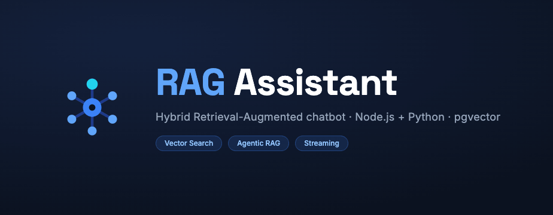
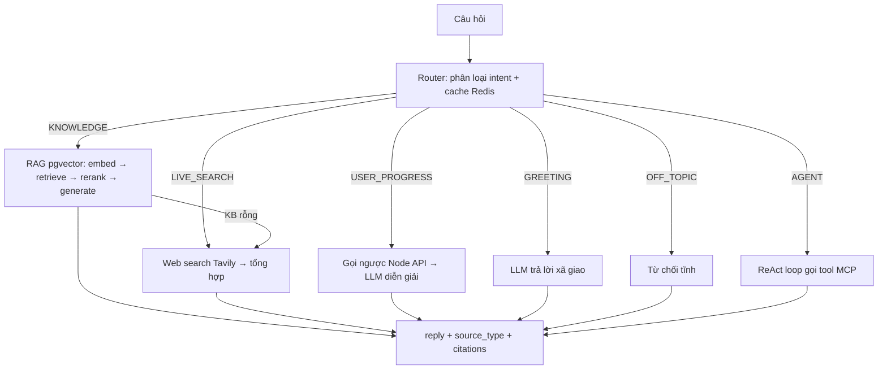
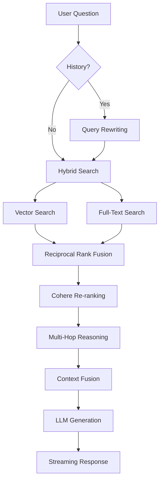

<div align="center">



<h1>🤖 Chatbot-RAG-Powered AI Assistant</h1>

<p><em>Hybrid Retrieval-Augmented chatbot · Node.js + Python · pgvector</em></p>

<p>
  
  
  
  
  
  
  
</p>

</div>

## 🧠 Giới Thiệu Dự Án

Chatbot AI thông minh kiến trúc **RAG (Retrieval-Augmented Generation)**, vận hành theo mô hình **hybrid**: backend Node.js và **lõi AI Python (FastAPI)** chạy song song, giao tiếp bất đồng bộ qua **Kafka** và stream thời gian thực qua **Redis Pub/Sub → WebSocket**.

- **🎯 RAG nội bộ**: Tìm kiếm vector (pgvector) + rerank trên kho tri thức đã index
- **🧭 Định tuyến intent**: 6 nhãn (KNOWLEDGE / LIVE_SEARCH / USER_PROGRESS / GREETING / OFF_TOPIC / AGENT) bằng LLM router, có cache Redis
- **🤖 Agentic RAG (MCP)**: Vòng lặp ReAct gọi tool qua Model Context Protocol (fetch, time, web search…)
- **🌐 Live search**: Tìm web thời gian thực (Tavily) khi câu hỏi cần dữ liệu cập nhật
- **⚡ Async + Streaming**: Chat qua Kafka worker, stream token qua WebSocket, polling kết quả qua Redis
- **🔒 Bảo mật**: JWT auth, shared-secret service-to-service, allowlist host LLM (chống SSRF), bound input

> **Kiến trúc**: React (frontend) + Node.js (gateway/RAG) + **Python FastAPI (lõi AI)** + Kafka + Redis + PostgreSQL/pgvector + Ollama

---

## 🚀 Tính Năng Chính

### ✅ **RAG Chatbot Thông Minh**
- **Vector Search**: Tìm kiếm semantic với embedding vectors
- **Knowledge Base**: Quản lý kiến thức dạng chunks với embedding
- **Smart Retrieval**: Tự động tìm context phù hợp nhất
- **Response Generation**: Trả lời dựa trên context + GPT

### 📚 **Quản Lý Kiến Thức**
- **Upload Files**: Hỗ trợ `.txt`, `.docx`, `.pdf`
- **Auto Chunking**: Chia nhỏ nội dung thành semantic chunks
- **Vector Embedding**: Tự động tạo embedding cho mỗi chunk
- **Admin Interface**: Quản lý kiến thức trực quan


### ⚡ **Tối Ưu Hiệu Suất**
- **Vector Indexing**: Tìm kiếm nhanh với large-scale vectors
- **Caching Layer**: Cache kết quả tìm kiếm
- **Hybrid Search**: Kết hợp vector + keyword search
- **Batch Processing**: Xử lý nhiều queries cùng lúc

### 🚀 **Advanced RAG**
- **Multi-Stage Retrieval**: Lấy chunks theo nhiều giai đoạn
- **Hybrid Search (RRF)**: Kết hợp Vector Search (Semantic) và Full-Text Search (Keyword)
- **Semantic Clustering**: Nhóm chunks theo chủ đề
- **Multi-Hop Reasoning**: Tìm mối liên kết giữa chunks
- **Context Re-ranking**: Sắp xếp lại context theo độ liên quan (Cohere/Heuristic)
- **Adaptive Retrieval**: Điều chỉnh retrieval dựa trên độ phức tạp
- **Query Rewriting**: Tự động viết lại câu hỏi dựa trên lịch sử hội thoại để tìm kiếm chính xác hơn
- **Streaming Response**: Phản hồi theo thời gian thực với server-sent events (SSE)

---

## 🏗️ Kiến Trúc Hệ Thống

```
        ┌─────────────┐        ┌──────────────────────────┐
        │  Frontend   │  HTTP  │   Backend (Node.js)      │
        │  (React)    │◄──────►│   gateway · RAG · auth   │
        │             │   WS   │   wallet · knowledge     │
        └─────────────┘◄──────►└──────────┬───────────────┘
                                          │
              ┌───────────────────────────┼───────────────────────┐
              │ Kafka (async chat)        │ Redis (job/cache/      │
              │ chat-requests/responses   │  Pub/Sub stream)       │
              ▼                           ▼                        │
        ┌───────────────┐         ┌──────────────────────────┐    │
        │  chat-worker  │────────►│  ai-service (Python)     │    │
        │  (consumer)   │  HTTP   │  FastAPI · LangGraph     │◄───┘
        └───────────────┘         │  intent · RAG · agentic  │
                                  └───────┬──────────┬───────┘
                                          │          │
                          ┌───────────────▼──┐   ┌───▼─────────┐   ┌──────────┐
                          │ PostgreSQL       │   │  Ollama     │   │   MCP    │
                          │ + pgvector       │   │ (on-prem)   │   │ servers  │
                          └──────────────────┘   └─────────────┘   └──────────┘
```

> **Hybrid**: Node và ai-service **dùng chung** Postgres (pgvector) + Redis. Câu chat đi async qua Kafka → worker gọi ai-service; token stream về client qua Redis Pub/Sub → WebSocket. Xem chi tiết lõi Python tại [`ai-service/README.md`](ai-service/README.md).

### **Luồng chat của ai-service (Python — đường mặc định hiện tại)**


### **Advanced RAG Flow (Node.js — đường legacy `/chat`, `/chat/stream`)**


#### **Chi Tiết Các Bước Xử Lý:**

1.  **📝 Query Rewriting (Viết Lại Câu Hỏi)**
    *   LLM phân tích lịch sử hội thoại để viết lại câu hỏi của người dùng thành một câu hoàn chỉnh, rõ nghĩa (VD: "Nó ở đâu?" -> "Trụ sở công ty ở đâu?").

2.  **🔍 Hybrid Search (Tìm Kiếm Lai)**
    *   **Vector Search**: Tìm kiếm dựa trên ngữ nghĩa (Semantic) sử dụng embedding vectors.
    *   **Full-Text Search**: Tìm kiếm dựa trên từ khóa chính xác (Keyword Matching).

3.  **⚗️ Fusion & Re-ranking**
    *   **RRF (Reciprocal Rank Fusion)**: Thuật toán kết hợp kết quả từ Vector và Keyword search để đảm bảo không bỏ sót thông tin quan trọng.
    *   **Cohere Re-ranking**: Sử dụng mô hình AI chuyên dụng để chấm điểm lại độ liên quan của từng đoạn thông tin (Chunk) với câu hỏi, loại bỏ tin rác.

4.  **🧠 Advanced Reasoning (Suy Luận Nâng Cao)**
    *   **Semantic Clustering**: Gom nhóm các đoạn thông tin có cùng chủ đề.
    *   **Multi-Hop Reasoning**: Tự động tìm kiếm thêm các thông tin liên kết logic nếu câu trả lời cần tổng hợp từ nhiều nguồn (A -> B -> C).

5.  **💡 Generation (Sinh Câu Trả Lời)**
    *   Tổng hợp Context đã được làm sạch và gửi cho LLM để sinh câu trả lời tự nhiên, chính xác.

---

## 📂 Cấu Trúc Dự Án (New Architecture)

```
chatbot-rag-hungv/
├── 📁 backend/                 # Node.js gateway (Modular Architecture)
│   ├── 📁 src/modules/         # Feature Modules (auth, chat, knowledge, wallet, user, learning…)
│   ├── 📁 src/kafka/           # Kafka producer + topics (chat-requests / chat-responses)
│   ├── 📁 src/workers/         # chat-worker: consume chat-requests → gọi AI → trả kết quả
│   ├── 📁 src/redis/           # ioredis client: job result (TTL) + Pub/Sub stream
│   ├── 📁 src/services/        # advancedRAGFixed.js, embeddingVector.js, momo/vnpay/email…
│   ├── 📁 src/shared/          # Middlewares (auth, rate-limit, error)
│   └── 📄 index.js             # API server + WebSocket relay (Redis → WS)
│
├── 📁 ai-service/              # ⭐ Lõi AI Python (FastAPI) — chạy hybrid song song Node
│   ├── 📁 app/
│   │   ├── 📄 main.py          # FastAPI: /health /chat /chat/stream /tools
│   │   ├── 📁 agents/          # LangGraph: graph + 7 node (router + 6 intent)
│   │   ├── 📁 intent/          # registry + classifier (cache Redis)
│   │   ├── 📁 rag/             # retrieval (pgvector) · rerank · pipeline
│   │   ├── 📁 services/        # llm · embeddings · db · cache · web_search · mcp_client
│   │   └── 📁 clients/         # node_api (gọi ngược Node cho USER_PROGRESS)
│   └── 📁 tests/               # unit · integration · eval
│
├── 📁 frontend/                # React (Feature-based: auth, chat, knowledge, wallet, user)
├── 📁 db/                      # SQL init + migrations
├── 📁 docs/                    # ADR, deploy checklist, spec
└── 📄 docker-compose.yml       # 12 services (7 lõi mặc định + profiles, xem mục Khởi Chạy)
```

---

## ⚙️ Cài Đặt & Chạy Dự Án

### **1. Yêu Cầu Hệ Thống**
- **Docker** + **Docker Compose** (7 service lõi mặc định; service nặng/tuỳ chọn bật qua profile — xem Khởi Chạy)
- **Node.js** 18+ (dev backend/frontend)
- **Python** 3.12 + [**uv**](https://docs.astral.sh/uv/) (dev ai-service)
- **PostgreSQL** 13+ với **pgvector** extension

### **2. Clone Repository**
```bash
git clone https://github.com/vuhung2197/chatbot-rag-hungv.git
cd chatbot-rag-hungv
```

### **3. Cấu Hình Environment**
```bash
# Copy file environment
cp .env.example .env

# Chỉnh sửa file .env
nano .env
```

**Cấu hình `.env`:**
```env
# Database (PostgreSQL)
DB_HOST=localhost
DB_PORT=5432
DB_USER=postgres
DB_PASSWORD=postgres123
DB_DATABASE=chatbot

# PostgreSQL Docker (Optional)
POSTGRES_USER=postgres
POSTGRES_PASSWORD=postgres123
POSTGRES_DB=chatbot

# OpenAI API (embeddings + LLM)
OPENAI_API_KEY=sk-your-openai-api-key

# Server
PORT=3001
NODE_ENV=development

# Frontend
REACT_APP_API_URL=http://localhost:3001

# Kafka & Redis (chat async + stream)
KAFKA_BROKERS=localhost:9094
REDIS_HOST=localhost
REDIS_PORT=6379

# ai-service (Python) — bảo mật & tính năng
INTERNAL_API_TOKEN=          # shared-secret Node ↔ Python (để rỗng ở dev)
TAVILY_API_KEY=              # web search (LIVE_SEARCH / fallback)
OLLAMA_BASE_URL=http://localhost:11434
# MCP_SERVERS=[...]          # allowlist server MCP (JSON) cho Agentic RAG
```

### **4. Khởi Chạy Với Docker**
```bash
# Chạy 7 service lõi (postgres, redis, backend, frontend, kafka, chat-worker, ai-service)
docker-compose up -d

# Xem logs
docker-compose logs -f

# Dừng services
docker-compose down
```

> 💡 **Tối ưu RAM (đặc biệt máy 16GB):** mặc định chỉ chạy 7 service lõi. Các service nặng/tuỳ chọn tách thành **profile**, chỉ bật khi cần:
>
> | Profile | Service | Lệnh |
> |---|---|---|
> | `tools` | pgAdmin, Kafka UI | `docker-compose --profile tools up -d` |
> | `quality` | SonarQube (+db) | `docker-compose --profile quality up -d` |
> | `ai-local` | Ollama (LLM on-prem) | `docker-compose --profile ai-local up -d` |
>
> Kết hợp nhiều profile được, ví dụ: `docker-compose --profile tools --profile quality up -d`.
> Gọi tên service trực tiếp cũng bật được dù nó thuộc profile, ví dụ `docker-compose up -d pgadmin`.

### **5. Khởi Chạy Development Mode**
```bash
# Backend
cd backend
npm install
npm start

# Frontend (terminal mới)
cd frontend
npm install
npm start

# ai-service (terminal mới) — lõi AI Python
cd ai-service
uv sync
uv run uvicorn app.main:app --reload --port 8000
curl localhost:8000/health    # kiểm tra
```

### **6. Truy Cập Ứng Dụng & Các Service**

| Service | URL / Port | Vai trò |
|---|---|---|
| Frontend (React) | http://localhost:3000 | Giao diện chat |
| Backend (Node.js) | http://localhost:3001 | API gateway + WebSocket (`/ws`) |
| ai-service (Python) | http://127.0.0.1:8000 | Lõi AI (chỉ loopback; truy cập qua Node) |
| PostgreSQL + pgvector | localhost:5432 | DB + vector store |
| Redis | localhost:6379 | Job result · cache · Pub/Sub |
| Kafka | localhost:9094 | Hàng đợi chat async |
| Kafka UI | http://localhost:8080 | Theo dõi topic/consumer |
| pgAdmin | http://localhost:5050 | Quản trị Postgres |
| Ollama | http://localhost:11434 | LLM on-premise |
| SonarQube | http://localhost:9000 | Phân tích chất lượng code |

> **Lưu ý**: `chat-worker` (consumer Kafka) chạy nền, không expose cổng.

-----

## 🗄️ Database Setup

### **1. Khởi Tạo Tự Động (Docker)**
Khi `docker-compose up`, Postgres tự chạy `db/init_postgres.sql` (mount vào `docker-entrypoint-initdb.d`) — tạo schema + bật extension `pgvector`. Không cần thao tác tay.

### **2. Migrations (khi cần cập nhật schema)**
```bash
# Áp 1 migration cụ thể
docker exec -i chatbot-postgres psql -U postgres -d chatbot < db/migrations/<tên-file>.sql
```
Thư mục `db/migrations/` chứa các thay đổi schema theo tính năng (learning hub, reading/writing/speaking, vocabulary, wallet…).

---

## 🎯 Sử Dụng Chatbot

### **1. Đăng Ký/Đăng Nhập**
- Truy cập http://localhost:3000
- Đăng ký tài khoản mới hoặc đăng nhập

### **2. Chat Với Bot**
- Nhập câu hỏi vào chat interface
- Bot sẽ tự động tìm kiếm kiến thức liên quan
- Nhận câu trả lời dựa trên RAG

### **3. Quản Lý Kiến Thức (Admin)**
- Upload file kiến thức (.txt, .docx, .pdf)
- Xem và chỉnh sửa chunks
- Quản lý câu hỏi chưa trả lời


---

## 🔧 API Endpoints

### **Authentication**
```http
POST /auth/register    # Đăng ký
POST /auth/login       # Đăng nhập
POST /auth/logout      # Đăng xuất
```

### **Chat**
```http
POST   /chat/async        # Gửi chat bất đồng bộ → trả requestId (xử lý qua Kafka)
GET    /chat/result/:jobId # Polling kết quả async từ Redis (200 done / 202 pending)
POST   /chat/stream       # Gửi tin nhắn (SSE streaming, context-aware)
POST   /chat              # Gửi tin nhắn (block, đồng bộ)
GET    /chat/history      # Lịch sử chat
DELETE /chat/history/:id  # Xóa tin nhắn
GET    /chat/tools        # Liệt kê MCP tool khả dụng (Agentic RAG)
WS     /ws                # WebSocket: subscribe requestId để nhận token stream
```

> Luồng async: `POST /chat/async` → Kafka → `chat-worker` → ai-service → kết quả về Redis + push qua WebSocket. Client có thể nhận realtime qua `/ws` hoặc polling `/chat/result/:jobId`.

### **Knowledge Management**
```http
GET    /knowledge      # Lấy danh sách kiến thức
POST   /knowledge      # Thêm kiến thức
PUT    /knowledge/:id  # Cập nhật kiến thức
DELETE /knowledge/:id  # Xóa kiến thức
```


### **File Upload**
```http
POST /upload          # Upload file
GET  /upload/:id      # Lấy file
```

---

## 📊 Performance & Monitoring

### **Vector Search Performance**
- **Small Dataset** (< 10K vectors): < 10ms
- **Medium Dataset** (10K-100K vectors): < 50ms  
- **Large Dataset** (100K+ vectors): < 100ms

### **Caching Strategy**
- **Embedding Cache**: Cache embeddings của câu hỏi thường gặp
- **Context Cache**: Cache kết quả tìm kiếm
- **Session Cache**: Cache dữ liệu session

### **Monitoring Commands**
```bash
# Kiểm tra performance
node test/vector_performance_test.js

# Xem database stats
psql -U postgres -d chatbot -c "SELECT COUNT(*) FROM knowledge_chunks;"

# Monitor logs
docker-compose logs -f backend
```

---

## 🛠️ Development

### **Code Structure**
- **Backend**: Node.js/Express modular monolith — gateway, RAG legacy, Kafka producer, WebSocket relay
- **ai-service**: Python 3.12 / FastAPI + LangGraph (uv) — intent router, RAG, Agentic/MCP
- **Frontend**: React feature-based
- **Database**: PostgreSQL + pgvector (dùng chung Node & Python)
- **Messaging**: Kafka (chat async), Redis (job result · cache · Pub/Sub stream)
- **LLM**: OpenAI-compatible + Ollama (on-prem)

### **Key Features**
- **Hybrid AI core**: Node và Python ai-service song song, dùng chung Postgres/Redis
- **Vector Database**: pgvector cho semantic search
- **Caching Layer**: Redis (intent cache, job result TTL)
- **Streaming**: token stream qua Kafka worker → Redis Pub/Sub → WebSocket
- **Error Handling**: degrade an toàn (không bubble 500), request_id trace xuyên log
- **Security**: JWT, shared-secret service-to-service, allowlist host LLM (chống SSRF), bound input

### **Testing**
```bash
# Chạy tests
npm test

# Performance testing
node test/vector_performance_test.js

# Load testing
node test/load_test.js
```

---

## 🚀 Deployment

### **Production Setup**
```bash
# Build production
docker-compose -f docker-compose.prod.yml up -d

# Environment variables
export NODE_ENV=production
export DB_HOST=your-db-host
export OPENAI_API_KEY=your-api-key
```

### **Scaling**
- **Horizontal**: Multiple backend instances
- **Database**: Read replicas cho vector search
- **Caching**: Redis cluster cho cache layer

---

## 📝 Roadmap

### **Phase 1: Performance** ✅
- [x] Vector database optimization
- [x] Caching implementation
- [x] Database indexing

### **Phase 2: Advanced Features** 🔄
- [x] Advanced RAG implementation
- [x] Hybrid search (vector + keyword)
- [x] Context re-ranking


### **Phase 3: Intelligence** 📋
- [ ] ML-based algorithm selection
- [ ] Feedback learning
- [ ] A/B testing framework

### **Phase 4: Scale** 📋
- [ ] Vector database migration
- [ ] Microservices architecture
- [ ] Enhanced UX

---

## 🤝 Contributing

1. **Fork** repository
2. **Create** feature branch (`git checkout -b feature/amazing-feature`)
3. **Commit** changes (`git commit -m 'Add amazing feature'`)
4. **Push** to branch (`git push origin feature/amazing-feature`)
5. **Open** Pull Request

---

## 📄 License

This project is licensed under the MIT License - see the [LICENSE](LICENSE) file for details.

---

## 👥 Authors

- **Hùng Vũ** - *Initial work* - [hung97vu@gmail.com](mailto:hung97vu@gmail.com)

---

## 🙏 Acknowledgments

- OpenAI API for GPT integration
- React community for excellent documentation
- PostgreSQL team and pgvector for vector search capabilities
- All contributors and testers

---

## 📞 Support

- **Issues**: [GitHub Issues](https://github.com/vuhung2197/chatbot-rag-hungv/issues)
- **Email**: hung97vu@gmail.com
- **Tài liệu**: [`ai-service/README.md`](ai-service/README.md), [`docs/`](docs/)