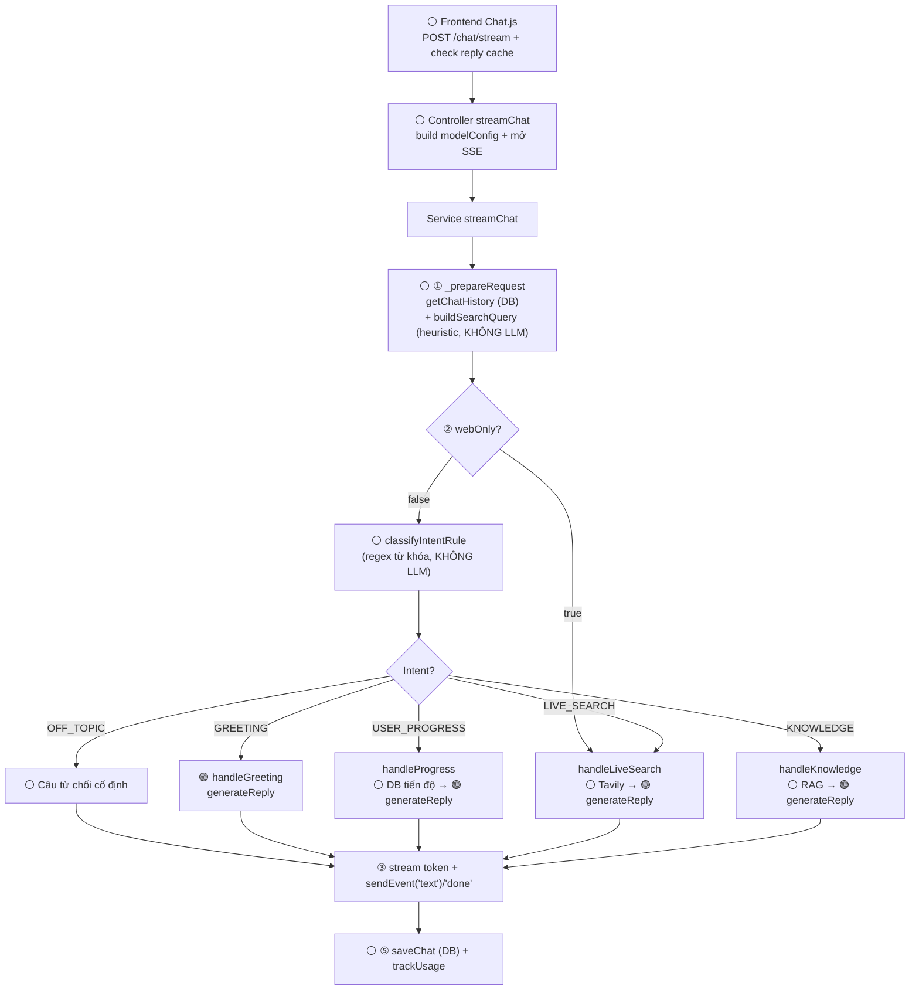
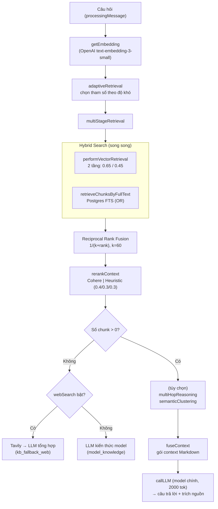
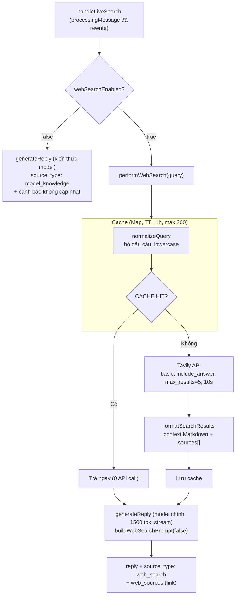
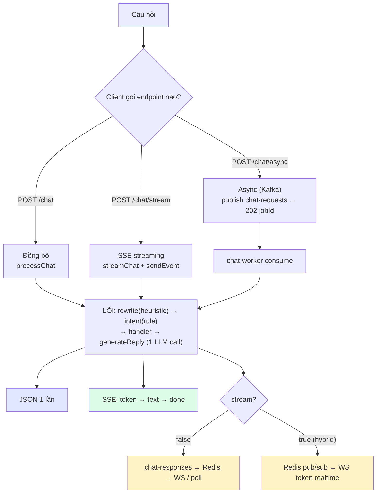
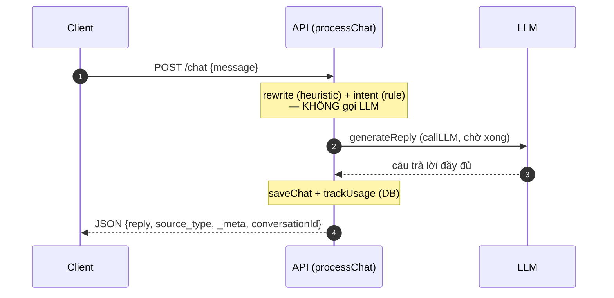
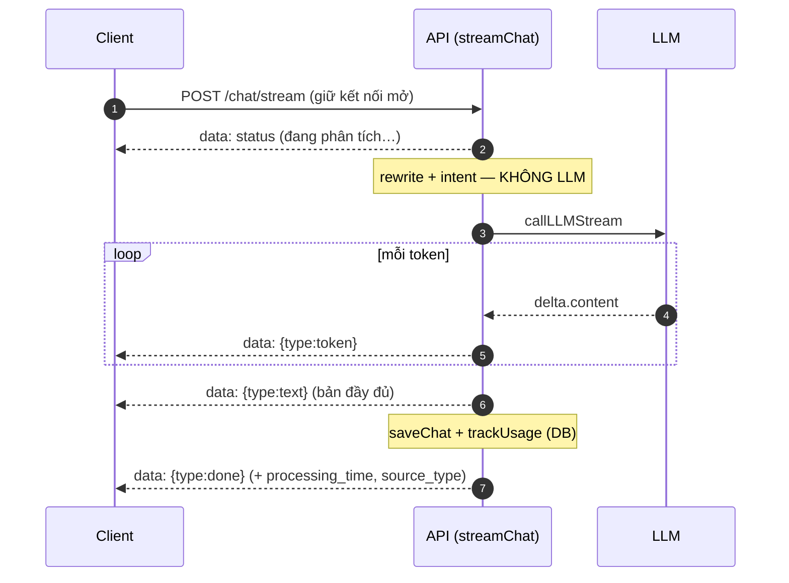
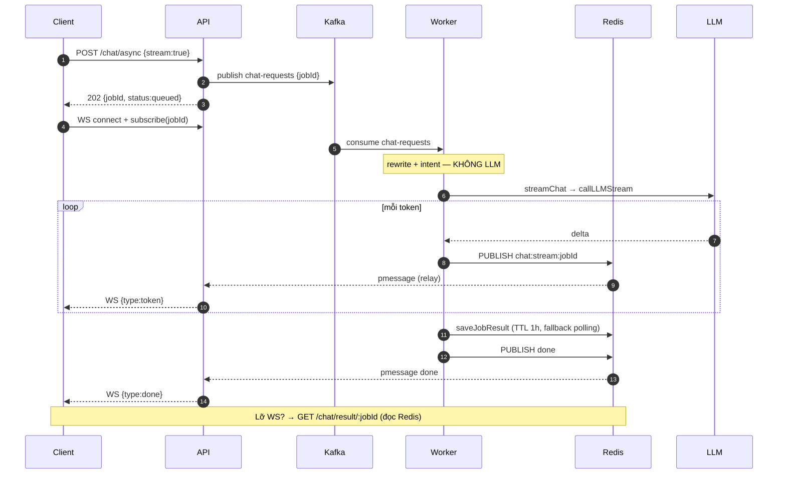

# Chatbot RAG — Luồng xử lý & kiến trúc

> Tài liệu tổng hợp luồng xử lý chính, hệ thống RAG, SSE stream và các cơ chế fallback.
> Nguồn: `backend/src/modules/chat` + `backend/services`.

---

## 0. Sơ đồ tổng quan (Mermaid)

### Luồng xử lý chính (kiến trúc 1-LLM-call)

> 🟢 = bước có LLM call · ⚪ = không LLM (DB/regex/heuristic/Tavily/embedding).
> Tối ưu: **chỉ generation gọi chat LLM**; rewrite + intent đã chuyển sang heuristic/rule-based.



### Pipeline RAG (nhánh KNOWLEDGE)



---

## 1. Tổng quan luồng 1 tin nhắn

```
Frontend (Chat.js)
  │  POST /chat/stream  { message, model, utilityModel, webOnly, conversationId }
  ▼
Controller (chat.controller.js → streamChat)
  │  build modelConfig (fallback OpenAI gpt-4o-mini) + mở SSE
  ▼
Service (chat.service.js → streamChat / processChat)
  │
  ├─① _prepareRequest:  getChatHistory (DB) + buildSearchQuery (heuristic, KHÔNG LLM)
  │
  ├─② Route intent:
  │     webOnly=true  → ép LIVE_SEARCH (bỏ qua phân loại + RAG)
  │     webOnly=false → classifyIntentRule (regex từ khóa, KHÔNG LLM)
  │
  ├─③ Handler theo intent (GREETING / USER_PROGRESS / LIVE_SEARCH / KNOWLEDGE / OFF_TOPIC)
  │
  ├─④ sendEvent('text') + sendEvent('done')
  │
  └─⑤ saveChat (DB) + usageService.trackUsage
```

- `/chat/stream` → `streamChat` (SSE, có trạng thái realtime).
- `/chat` → `processChat` (trả JSON một lần, logic tương đương).

---

## 2. SSE Stream (Server-Sent Events)

Server đẩy dữ liệu liên tục qua 1 kết nối HTTP mở sẵn → UI hiển thị tiến trình realtime.

```js
res.setHeader('Content-Type', 'text/event-stream');
const sendEvent = (type, data) => res.write(`data: ${JSON.stringify({type, ...data})}\n\n`);
```

- Thứ tự sự kiện: `status` (nhiều lần) → `text` (câu trả lời) → `done` (reasoning_steps, chunks_used).
- Frontend đọc bằng `response.body.getReader()`, tách theo `\n\n`, cập nhật UI từng event.
- Kết nối **không đóng** giữa các event (khác request HTTP thường).

---

## 3. Phân loại Intent (5 nhánh)

| Intent | Handler | Xử lý |
|---|---|---|
| OFF_TOPIC | inline | Câu từ chối, không gọi LLM |
| GREETING | greeting.handler | 1 LLM call (model chính), không RAG |
| USER_PROGRESS | progress.handler | Truy vấn tiến độ học của user → LLM tóm tắt |
| LIVE_SEARCH | live-search.handler | Tavily web search → LLM tổng hợp |
| KNOWLEDGE | knowledge.handler | RAG đầy đủ → fallback web/model |

**Phân loại bằng `classifyIntentRule` (regex từ khóa, KHÔNG gọi LLM)** — không khớp gì → mặc định KNOWLEDGE.
- GREETING: `hi/chào/cảm ơn/bạn là ai…`
- USER_PROGRESS: `tiến độ/của tôi/tôi đã học…`
- LIVE_SEARCH: `hôm nay/hiện tại/giá/thời tiết/tin tức…`
- OFF_TOPIC: danh sách nhạy cảm tối thiểu
- KNOWLEDGE: mặc định

> Bản LLM `classifyIntent` vẫn còn trong code (test dùng) nhưng **không dùng trong flow live**. Đổi để bỏ 1 LLM call.

---

## 4. Pipeline RAG (nhánh KNOWLEDGE)

```
adaptiveRetrieval   → chọn THAM SỐ theo độ khó câu hỏi
multiStageRetrieval → Hybrid Search (vector + fulltext) + RRF → chunk thô
rerankContext       → chấm điểm lại, sắp xếp, lọc → chunk tinh
  ├─ 0 chunk → fallback (web search / kiến thức model)
  └─ có chunk → [multiHop/clustering nếu cần] → fuseContext → callLLM sinh trả lời
```

### 4.1 adaptiveRetrieval — chọn tham số theo độ khó
Phân tích từ khóa trong câu hỏi:
- `so sánh / khác biệt / mối quan hệ` → **complex**: maxChunks 5→10, threshold 0.5→0.3
- nhiều `và / với / kết hợp` → **multiTopic**: maxChunks 15 + clustering
- `tại sao / như thế nào / giải thích` → bật **multiHop** + clustering

| Mức | maxChunks | threshold | multiHop | clustering |
|---|---|---|---|---|
| simple | 5 | 0.5 | ✗ | ✗ |
| complex | 10 | 0.3 | ✓ | ✗ |
| multiTopic | 15 | — | — | ✓ |

### 4.2 multiStageRetrieval — Hybrid Search + RRF
Chạy **song song** 2 cách tìm rồi trộn:
- **performVectorRetrieval** (theo NGHĨA): pgvector `embedding <=> $1` (cosine), 2 tầng ngưỡng:
  - Tầng 1: topK=5, threshold=0.65 (chặt)
  - Tầng 2: topK=8, threshold=0.45 (lỏng)
  - `removeDuplicateChunks` khử trùng theo `id_title`.
- **retrieveChunksByFullText** (theo TỪ KHÓA): Postgres FTS `to_tsquery` nối OR, chấm `ts_rank`.

**Reciprocal Rank Fusion (RRF):** mỗi chunk được điểm `1/(k + thứ_hạng) × weight`, `k=60`, cộng từ cả 2 danh sách.
→ Chunk xếp cao ở **cả 2** cách tìm → tổng điểm cao nhất. Không cần chuẩn hóa thang điểm.

### 4.3 rerankContext — xếp hạng lại lần cuối
2 chế độ (tự chọn):
- **Cohere** (nếu có `COHERE_API_KEY`): model `rerank-multilingual-v3.0`, lọc `final_score < 0.3`.
- **Heuristic** (mặc định, không cần API):
  ```
  final = relevance×0.4 + coherence×0.3 + completeness×0.3
  ```
  | Thành phần | Ý nghĩa |
  |---|---|
  | relevance | điểm RRF (liên quan ngữ nghĩa) |
  | coherence | chunk giống các chunk khác cỡ nào (cosine TB) |
  | completeness | % từ trong câu hỏi xuất hiện trong chunk |

### 4.4 Bước nâng cao (chỉ bật khi câu hỏi phức tạp)
- **multiHopReasoning** (`tại sao/như thế nào`): mỗi chunk gốc (tối đa 3) tìm thêm 3 chunk liên quan (cosine > 0.4) → "chuỗi suy luận" nối nhiều bước.
- **semanticClustering** (đa chủ đề): dựng ma trận tương đồng, gom chunk giống nhau (> 0.6) thành cụm.

### 4.5 fuseContext — gói context cho LLM
Nhóm chunk theo chủ đề (NLP/AI/ML/Chatbot/Vector…) thành chuỗi Markdown có cấu trúc, thêm phần "Mối liên kết thông tin" nếu có reasoningChains. Đây là `system prompt` đưa cho LLM sinh câu trả lời.

---

## 4B. Luồng LIVE_SEARCH (chi tiết)

Dùng cho câu hỏi thời gian thực: giá vàng, thời tiết, tin tức, tỷ giá…

### Khi nào vào nhánh này
1. **Tự động**: `classifyIntentRule` (regex) thấy từ khóa thời gian thực (`hôm nay`, `hiện tại`, `mới nhất`, `giá`, `thời tiết`, `tin tức`…).
2. **Ép buộc**: bật nút "Tìm web" (`webOnly=true`) → bỏ qua phân loại + RAG, ép `LIVE_SEARCH`.

### Sơ đồ



### performWebSearch (`services/webSearch.service.js`)
- **Cache in-memory** (`Map`): `normalizeQuery` ("Giá vàng hôm nay?" → "giá vàng hôm nay") để tăng hit; TTL **1h**, tối đa **200** entry, tự dọn hết hạn + evict cũ nhất.
- **Tavily** (search engine tối ưu cho LLM): `POST https://api.tavily.com/search` với `search_depth:'basic'`, `include_answer:true` (Tavily tự tóm tắt), `max_results:5`, timeout 10s.
- Thiếu `TAVILY_API_KEY` → hot-reload từ `.env`; vẫn thiếu → trả "chưa cấu hình".
- `formatSearchResults` → `{ context (Markdown đưa LLM), sources ([{title,url}]) }`.

### Tổng hợp
- `buildWebSearchPrompt(false)`: yêu cầu trả lời dựa trên kết quả web, **dẫn nguồn `[Title](URL)`**, kèm thời gian hiện tại.
- `generateReply` (model chính, 1500 token, stream qua `onToken`) → `toAdvancedMarkdown`.

### Khác biệt với web fallback của KNOWLEDGE
| | LIVE_SEARCH | KNOWLEDGE → fallback web |
|---|---|---|
| Khi nào | câu thời gian thực / webOnly | KB trống (RAG 0 chunk) |
| RAG trước đó | **không** chạy | chạy đủ rồi mới fallback |
| source_type | `web_search` | `kb_fallback_web` |
| Prompt | `buildWebSearchPrompt(false)` | `buildWebSearchPrompt(true)` |

> LIVE_SEARCH = đi **thẳng** tới web (không RAG); web trong KNOWLEDGE chỉ là dự phòng. Cache 1h tránh gọi Tavily lặp lại.

---

## 5. Cơ chế Fallback (nhiều tầng dự phòng)

| Vị trí | Khi nào | Hành vi |
|---|---|---|
| buildSearchQuery | không có history | dùng câu gốc (không ghép) |
| classifyIntentRule | không khớp luật nào | mặc định KNOWLEDGE |
| RAG 0 chunks | KB trống/không khớp | web search → (web tắt) kiến thức model |
| web search lỗi | Tavily fail/chưa cấu hình | câu "Tôi chưa có đủ thông tin…" |
| rerank lỗi | Cohere/heuristic ném lỗi | trả nguyên chunks chưa rerank |
| llmService | content rỗng | cảnh báo + để caller fallback (KHÔNG dùng reasoning_content) |

`source_type` đầu ra: `knowledge` | `kb_fallback_web` | `model_knowledge` | `web_search`.

---

## 6. Cấu hình Model (per-request)

Request body nhận: `model`, `utilityModel`, `webOnly`, (`webSearch`).

- **utilityModel** = (DI SẢN) trước dùng cho rewrite+intent; nay 2 bước đó **không gọi LLM** nữa → utilityModel **không còn tác dụng** trong flow (vẫn được truyền qua nhưng bỏ qua).
- **webOnly** = đi thẳng web search, bỏ qua phân loại intent + RAG (vẫn giữ buildSearchQuery heuristic).
- **Embedding luôn dùng OpenAI** `text-embedding-3-small` — độc lập với model chat. (Cần `OPENAI_API_KEY` kể cả khi chat bằng model local.)

### Token theo bước — CHỈ generation gọi LLM
| Bước | LLM? | Model | max_tokens |
|---|---|---|---|
| classifyIntentRule (intent) | ❌ regex | — | — |
| buildSearchQuery (rewrite) | ❌ heuristic | — | — |
| greeting | ✅ | chính | 800 |
| generation (KNOWLEDGE) | ✅ | chính | 2000 |
| web/live synthesis | ✅ | chính | 1500 |
| progress | ✅ | chính | 1500 |

> Mỗi request chỉ **1 chat LLM call** (bước generation). Model reasoning để output ở `reasoning_content`; nếu max_tokens thấp → `content` rỗng → vì vậy token đặt cao.

### callLLM (điểm chung mọi LLM call)
`backend/services/llmService.js`:
- Chuẩn hóa URL: `localhost`/`127.0.0.1` → `host.docker.internal`; `/api/v1` → `/v1`; nối `/chat/completions`.
- Chỉ đọc `message.content` (không fallback `reasoning_content`).

---

## 7. Hằng số quan trọng (RAG_CONFIG)

```
vector.stages: [{topK:5, threshold:0.65}, {topK:8, threshold:0.45}]
fullText.defaultLimit: 10
rrf: { k:60, vectorWeight:1.0, textWeight:1.0 }
reranking: { minScore:0.3, heuristicWeights:{relevance:0.4, coherence:0.3, completeness:0.3} }
clustering.similarityThreshold: 0.6
multiHop: { maxSourceChunks:3, relatedChunksPerSource:3, relatedMinSimilarity:0.4 }
adaptive: simple{5,0.5} | complex{10,0.3} | multiTopic{15}
```

---

## 8. Bảng tệp tham chiếu

| Thành phần | File |
|---|---|
| Controller | `backend/src/modules/chat/controllers/chat.controller.js` |
| Service (điều phối) | `backend/src/modules/chat/services/chat.service.js` |
| Handlers | `backend/src/modules/chat/handlers/*.handler.js` |
| Helpers (prompt, save) | `backend/src/modules/chat/handlers/chat.helpers.js` |
| LLM call | `backend/services/llmService.js` |
| Embedding | `backend/services/embeddingVector.js` |
| Web search | `backend/services/webSearch.service.js` |
| RAG config | `backend/services/rag/config.js` |
| Adaptive | `backend/services/rag/adaptive.js` |
| Hybrid + RRF | `backend/services/rag/retrieval/hybrid.retriever.js` |
| Vector retriever | `backend/services/rag/retrieval/vector.retriever.js` |
| Fulltext retriever | `backend/services/rag/retrieval/fulltext.retriever.js` |
| Rerank (chọn) | `backend/services/rag/reranking/reranker.js` |
| Rerank Cohere | `backend/services/rag/reranking/cohere.reranker.js` |
| Rerank heuristic | `backend/services/rag/reranking/heuristic.reranker.js` |
| Multi-hop | `backend/services/rag/reasoning/multi-hop.js` |
| Clustering | `backend/services/rag/reasoning/semantic-cluster.js` |
| Fuse context | `backend/services/rag/context/fusion.js` |

---

## 9. Ba chế độ chat & cách chọn

Cùng **một lõi xử lý** (rewrite heuristic → intent rule → handler → **1 LLM call** ở generation), chỉ khác cách **nhận request** và **trả kết quả**.



### Cách CHỌN chế độ — dựa trên ENDPOINT client gọi
Không có "công tắc" ở server — **chế độ = endpoint mà client gọi**:

| Muốn | Gọi | Body | Nhận kết quả |
|---|---|---|---|
| Đồng bộ | `POST /chat` | `{message, model}` | JSON trả về luôn |
| Streaming | `POST /chat/stream` | `{message, model}` | đọc SSE (`data: {...}`) |
| Async (cục) | `POST /chat/async` | `{message}` | 202 + `jobId` → WS push hoặc `GET /chat/result/:jobId` |
| Async + stream (hybrid) | `POST /chat/async` | `{message, stream:true}` | mở WS, subscribe `jobId` → token realtime |

### Hiện trạng & cách cho người dùng tự chọn
- **Frontend hiện cố định `/chat/stream`** (hardcode trong `Chat.js sendChat`). Người dùng **chưa** chọn được chế độ.
- Để cho chọn: thêm 1 state `chatMode` ở frontend → đổi endpoint + cách xử lý response:
  ```
  sync   → fetch /chat        → đọc JSON
  stream → fetch /chat/stream → reader SSE (như hiện tại)
  async  → fetch /chat/async  → mở WS + subscribe jobId, hoặc poll /chat/result/:jobId
  ```
- Lưu ý mỗi chế độ xử lý response **khác nhau** (JSON vs SSE vs WS), nên selector phải kèm logic tương ứng.

### Chọn chế độ nào khi nào
| Tình huống | Nên dùng |
|---|---|
| Chat tương tác thông thường | **stream** (UX mượt, token chạy ngay) |
| Cần JSON gọn cho tích hợp/máy gọi máy | **sync** |
| Tải cao / tác vụ dài / cần bền (rớt mạng vẫn lấy được) | **async** (poll) |
| Vừa nền-bền vừa muốn token realtime | **hybrid** (async + stream) |

---

## 10. Chi tiết từng luồng chat (sơ đồ sequence)

> Lõi chung của cả 3: **rewrite (heuristic) → intent (rule) → handler → 1 LLM call**. Khác nhau ở cách nhận request & trả kết quả. (Bước rewrite + intent KHÔNG gọi LLM.)

### 10.1 Sync — `POST /chat`
Chờ xử lý xong, trả JSON một lần.



### 10.2 Streaming — `POST /chat/stream` (SSE, frontend đang dùng)
Giữ 1 kết nối HTTP, đẩy token chạy dần.



### 10.3 Async + Hybrid — `POST /chat/async {stream:true}`
Nhả request ngay (202 + jobId); worker xử lý nền; token realtime qua WebSocket; kết quả lưu Redis để polling.



> ⚠️ **Race (hybrid)**: Redis pub/sub KHÔNG buffer → client phải subscribe TRƯỚC khi worker stream. Thứ tự đúng: mở WS → POST → subscribe ngay. `saveJobResult` là lưới an toàn cho token bị lỡ.

### Số LLM call mỗi luồng
| Luồng | LLM call | Trả kết quả |
|---|---|---|
| sync | 1 (callLLM) | JSON 1 lần |
| stream | 1 (callLLMStream) | SSE token → done |
| async/hybrid | 1 (callLLMStream, ở worker) | WS token + Redis polling |
