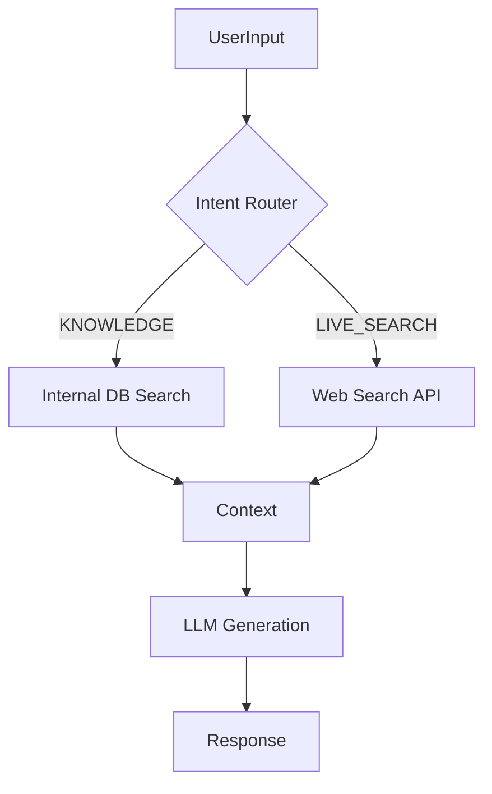

# 🌐 Kế Hoạch Tích Hợp Web Search (Real-time Information)

Tài liệu này hướng dẫn cách nâng cấp hệ thống Chatbot để hỗ trợ tìm kiếm thông tin theo thời gian thực (Giá vàng, Thời tiết, Tin tức, Chứng khoán...) tương tự như các LLM lớn.

---

## 1. Kiến Trúc Cập Nhật

Hiện tại: `Router` -> `Internal DB (RAG)` -> `LLM`
Nâng cấp: `Router` -> `Internal DB` **HOẶC** `Web Search API` -> `LLM`

Chúng ta sẽ thêm một nhánh xử lý mới vào `chat.controller.js`.

### Sơ Đồ Luồng Dữ Liệu Mới



---

## 2. Lựa Chọn API Tìm Kiếm (Search Providers)

Để bot có thể "nhìn thấy" internet, cần kết nối với một Search API. Dưới đây là các lựa chọn tốt nhất cho AI Agent:

| Provider | Ưu điểm | Nhược điểm | Chi phí | Khuyên dùng |
| :--- | :--- | :--- | :--- | :--- |
| **Tavily AI** | Tối ưu riêng cho LLM, trả về text sạch, không có quảng cáo/rác. | Mới, ít phổ biến hơn Google. | Free 1000 requests/tháng. | ⭐⭐⭐⭐⭐ (Best) |
| **Serper.dev** | Dữ liệu Google Search, nhanh, rẻ. | Trả về JSON cấu trúc Google, cần parse kỹ. | Free 2500 requests (thử nghiệm). | ⭐⭐⭐⭐ |
| **Google Custom Search** | Chính chủ Google. | Setup phức tạp, giới hạn request thấp, trả về nhiều rác HTML. | Free 100/ngày. | ⭐⭐ |
| **Bing Search API** | Dữ liệu tốt, microsoft ecosystem. | Cần Azure account, setup hơi cồng kềnh. | Có gói free tier. | ⭐⭐⭐ |

**Đề xuất:** Sử dụng **Tavily AI** vì nó tự động trích xuất nội dung chính (scrape) từ các trang web, giúp LLM có context chất lượng ngay lập tức mà không cần code thêm phần cào dữ liệu.

---

## 3. Các Bước Thực Hiện Chi Tiết

### Bước 1: Setup API Key
1.  Đăng ký tài khoản tại [tavily.com](https://tavily.com/).
2.  Lấy API Key.
3.  Thêm vào `.env`: `TAVILY_API_KEY=tvly-xxxxxxxx`

### Bước 2: Cập Nhật Intent Router (`intentRouter.js`)
Cần dạy Router nhận biết khi nào người dùng cần thông tin bên ngoài.

**Thêm Intent mới:** `LIVE_SEARCH`

**Prompt Update:**
```text
4. LIVE_SEARCH: Các câu hỏi về dữ liệu thời gian thực (giá vàng hôm nay, thời tiết, tỷ số bóng đá, tin tức mới nhất), hoặc các thông tin không có khả năng nằm trong cơ sở dữ liệu nội bộ.
```

### Bước 3: Tạo Service Web Search (`webSearch.service.js`)

Viết một service để gọi API Tavily:

```javascript
// Pseudo-code
async function performWebSearch(query) {
    const response = await axios.post('https://api.tavily.com/search', {
        api_key: process.env.TAVILY_API_KEY,
        query: query,
        include_answer: true, // Tavily có thể tự trả lời ngắn
        search_depth: "basic",
        max_results: 5
    });
    
    // Format lại kết quả thành context string
    return response.data.results.map(r => 
        `Title: ${r.title}\nSource: ${r.url}\nContent: ${r.content}`
    ).join('\n---\n');
}
```

### Bước 4: Tích Hợp Vào Controller (`chat.controller.js`)

Sửa hàm `chat`:

```javascript
// ... Logic Router cũ ...
if (intent === 'LIVE_SEARCH') {
    console.log('🌍 Performing Web Search...');
    const searchContext = await performWebSearch(message);
    
    // Ghép vào prompt và gọi LLM như bình thường
    const systemPrompt = "Bạn là trợ lý cập nhật tin tức. Trả lời dựa trên kết quả tìm kiếm dưới đây...";
    const reply = await callLLM(model, promptWithSearchContext);
    
    return res.json({ reply, source: 'web' });
}
// ... Logic RAG cũ ...
```

---

## 4. Thách Thức & Giải Pháp

1.  **Độ trễ (Latency):**
    *   Web Search tốn thời gian (1s - 3s).
    *   *Giải pháp:* Hiển thị loading state rõ ràng ở Frontend ("Đang tìm kiếm trên internet...").

2.  **Độ chính xác:**
    *   Web có thể chứa tin giả.
    *   *Giải pháp:* Yêu cầu LLM trích dẫn nguồn (Link URL) trong câu trả lời để người dùng tự kiểm chứng.

3.  **Ngày giờ:**
    *   LLM không biết "hôm nay" là ngày nào.
    *   *Giải pháp:* Luôn kèm `Current Date: ${new Date().toISOString()}` vào System Prompt để LLM biết ngữ cảnh thời gian xử lý câu hỏi "giá vàng hôm nay".

---

## 5. Lộ Trình Triển Khai

1.  [ ] Đăng ký Tavily API Key.
2.  [ ] Tạo file `backend/services/webSearch.service.js`.
3.  [ ] Cập nhật `intentRouter.js` thêm intent `LIVE_SEARCH`.
4.  [ ] Sửa `chat.controller.js` để đấu nối service mới.
5.  [ ] Test với các câu hỏi: "Thời tiết Hà Nội hôm nay", "Giá vàng SJC", "Kết quả bóng đá hôm qua".

---
*Tài liệu nghiên cứu bởi Antigravity.*
