```mermaid
graph TD
    UserInput[User Input] --> Router{0. Intent Router}
    
    %% Nhánh 1: Greeting
    Router -- GREETING --> DirectLLM[Direct LLM Reply]
    DirectLLM --> Response
    
    %% Nhánh 2: Off-topic
    Router -- OFF_TOPIC --> Refusal[Safety Refusal]
    Refusal --> Response
    
    %% Nhánh 3: Knowledge (RAG Pipeline)
    Router -- KNOWLEDGE --> RAG_Start((Start RAG))
    
    subgraph "Advanced RAG Pipeline"
        RAG_Start --> Embedding[1. Embedding Generation]
        Embedding --> Adaptive[2. Adaptive Retrieval Params]
        Adaptive --> HybridSearch{3. Hybrid Search}
        
        HybridSearch --> Vector[Vector Search]
        HybridSearch --> FullText[Full-Text Search]
        
        Vector --> RRF[4. RRF Fusion]
        FullText --> RRF
        
        RRF --> ReRanking[5. Cohere Re-ranking]
        ReRanking --> Threshold{Score > 0.3?}
        
        Threshold -- No --> NoKnowledge[Fallback: I don't know]
        Threshold -- Yes --> Synthesis[6. Context Synthesis]
        
        Synthesis --> Clustering[Semantic Clustering]
        Synthesis --> Reasoning[Multi-hop Reasoning]
        
        Clustering --> Fusion[7. Context Fusion]
        Reasoning --> Fusion
        
        Fusion --> Generation[8. LLM Generation]
    end
    
    Generation --> Response
    NoKnowledge --> Response
```

# 🔄 Luồng Xử Lý Advanced RAG - Chi Tiết (Updated)

**Phiên bản:** 2.0 (Tích hợp Intent Router)
**Cập nhật lần cuối:** 05/02/2026

## 📋 Tổng Quan

Hệ thống Chatbot hiện tại sử dụng kiến trúc **Advanced RAG** với **Intent Routing** làm cổng vào (Gateway). Hệ thống không áp dụng RAG một cách mù quáng cho mọi câu hỏi mà phân loại ý định người dùng trước để chọn chiến lược trả lời tối ưu:
1.  **Giao tiếp xã giao (Greeting):** Trả lời nhanh bằng LLM, không tốn tài nguyên RAG.
2.  **Hỏi kiến thức (Knowledge):** Kích hoạt Advanced RAG Pipeline (Hybrid Search -> Re-ranking -> Reasoning).
3.  **Chủ đề cấm (Off-topic):** Từ chối trả lời dựa trên Policy.

---

## 🏗️ Luồng Xử Lý Tổng Thể



---

## 📝 Phân Tích Chi Tiết Từng Bước (Code Level)

### **Bước 0: Intent Routing (Định Tuyến Ý Định)**
*Cổng vào thông minh của hệ thống.*

*   **File:** `backend/services/intentRouter.js`
*   **Hàm:** `classifyIntent(message, model)`
*   **Logic:**
    *   Gọi model LLM nhỏ (GPT-4o-mini) với `temperature=0.1` (gần như deterministic).
    *   **System Prompt:** Ép model trả về JSON `{ "intent": "...", "reasoning": "..." }`.
    *   **Phân loại:**
        *   `GREETING`: "Xin chào", "Cảm ơn" -> **Direct Reply**.
        *   `OFF_TOPIC`: Chính trị, bạo lực -> **Block**.
        *   `KNOWLEDGE`: Hỏi thông tin -> **RAG**.
    *   **Fallback:** Nếu JSON lỗi -> Mặc định là `KNOWLEDGE` (thà tìm thừa còn hơn bỏ sót).
*   **Tại sao quan trọng?** Giảm 30-50% chi phí và độ trễ bằng cách bỏ qua RAG cho các câu câu xã giao đơn giản.

---

### **Bước 1: Embedding Generation**
*Chuyển đổi câu hỏi thành vector.*

*   **File:** `backend/services/embeddingVector.js`
*   **Hàm:** `getEmbedding(text)`
*   **Logic:**
    *   Sử dụng API `text-embedding-3-small` của OpenAI.
    *   Output: Vector 1536 chiều.
    *   Đây là đầu vào bắt buộc cho Vector Search ở bước sau.

---

### **Bước 2: Adaptive Retrieval (Thích Ứng)**
*Đo ni đóng giày tham số tìm kiếm.*

*   **File:** `backend/services/advancedRAGFixed.js`
*   **Hàm:** `adaptiveRetrieval(question)`
*   **Logic:**
    *   Phân tích từ khóa để xác định độ phức tạp:
        *   "so sánh", "khác biệt" -> **Complex** -> Tăng `maxChunks` lên 10-15, bật `MultiHop`.
        *   Đơn giản -> **Simple** -> `maxChunks` = 5, tắt các tính năng nâng cao.
    *   Mục đích: Cân bằng giữa Performance (tốc độ) và Quality (độ sâu).

---

### **Bước 3: Hybrid Search (Tìm Kiếm Lai)**
*Lưới đánh cá 2 lớp: Bắt ý nghĩa và bắt từ khóa.*

*   **File:** `backend/services/advancedRAGFixed.js`
*   **Hàm:** `multiStageRetrieval(embedding, question)`
*   **Logic (Chạy song song):**
    1.  **Vector Search:** `embedding <=> vector` (Cosine distance). Tìm các đoạn văn có *ý nghĩa* tương đồng.
        *   Chạy 2 pass: High threshold (0.65) và Medium threshold (0.45).
    2.  **Full-Text Search:** `to_tsvector @@ to_tsquery`. Tìm các đoạn văn có *từ khóa* chính xác (quan trọng cho tên riêng, thuật ngữ kỹ thuật).
*   **Kết hợp:** Các kết quả được đưa vào bước 4.

---

### **Bước 4: Reciprocal Rank Fusion (RRF)**
*Trộn kết quả công bằng.*

*   **File:** `backend/services/advancedRAGFixed.js`
*   **Hàm:** `reciprocalRankFusion(vectorResults, textResults)`
*   **Logic:**
    *   Vì điểm số cosine (0.0-1.0) và điểm full-text (không giới hạn) không so sánh được với nhau, ta dùng **Thứ Hạng (Rank)**.
    *   Công thức: `Score = 1 / (k + Rank)`.
    *   Chunk nào xuất hiện ở top cả 2 danh sách sẽ có điểm RRF rất cao -> Ưu tiên chọn.

---

### **Bước 5: Re-ranking & Thresholding**
*Bộ lọc tinh nhuệ.*

*   **File:** `backend/services/advancedRAGFixed.js`
*   **Hàm:** `rerankContext(chunks, question)`
*   **Logic:**
    *   **Ưu tiên 1 (Cohere AI):** Nếu có key, gọi model Rerank chuyên dụng. Model này "đọc" kỹ từng cặp (Câu hỏi - Chunk) để chấm điểm độ liên quan thực sự.
    *   **Ưu tiên 2 (Heuristic):** Tính thủ công dựa trên keyword overlap và semantic similarity.
    *   **Thresholding (Chốt chặn):** Loại bỏ thẳng tay các chunks có điểm < 0.3.
    *   **Kết quả:** Nếu danh sách rỗng sau khi lọc -> Trả về "Tôi không biết" ngay lập tức (Chống ảo giác).

---

### **Bước 6: Context Synthesis & Fusion**
*Nấu cỗ cho LLM.*

*   **File:** `backend/services/advancedRAGFixed.js`
*   **Logic:**
    1.  **Semantic Clustering:** Nhóm các chunk có nội dung lá ná nhau lại (tránh lặp tin).
    2.  **Multi-Hop Reasoning (nếu cần):** Tự động tìm thêm chunk C nếu A và B gợi ý đến C (dù C không khớp câu hỏi gốc).
    3.  **Fusion:** Ghép tất cả lại thành một đoạn văn bản Markdown có cấu trúc phân cấp:
        ```markdown
        # Thông tin chính
        ## Chủ đề A...
        ## Chủ đề B...
        # Mối liên kết...
        ```

---

### **Bước 7: LLM Generation**
*Sinh câu trả lời cuối cùng.*

*   **File:** `backend/modules/chat/chat.controller.js`
*   **Hàm:** `askAdvancedChatGPT`
*   **Logic:**
    *   Input: `FusedContext` + `UserQuestion`.
    *   **System Prompt:** "Bạn là chuyên gia... Trả lời dựa trên thông tin cung cấp... Trích dẫn nguồn...".
    *   Model sinh ra text trả lời.

---

## 📊 Cấu Trúc Dữ Liệu Phản Hồi (API Response)

```json
{
  "reply": "Markdown content...",
  "reasoning_steps": [
    "Intent identified as KNOWLEDGE",
    "Retrieved 15 chunks (Hybrid)",
    "Selected 4 chunks after Re-ranking",
    "Generated response..."
  ],
  "chunks_used": [
    {
      "id": 101,
      "title": "Document A",
      "score": 0.98,
      "source": "vector"
    }
  ],
  "metadata": {
    "processing_time": 2450,
    "total_chunks": 15,
    "model_used": "gpt-4o"
  }
}
```
